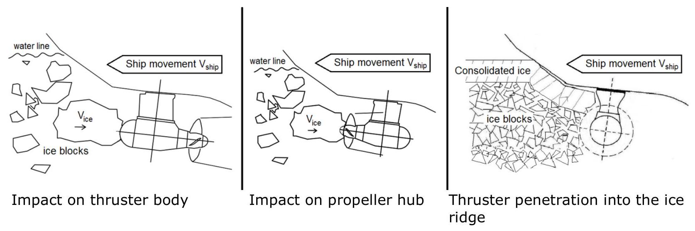

| Issued: | Enters into force: | Validity: |
| :--- | :--- | :--- |
| 1 July 2021 | 5 July 2021 | untill further notice |
| Legal basis: |  |  |
|  |  | Act on the Ice Classes of Ships and Icebreaker Assistance (1121/2005) section 4(1) |
|  |  | Provisions on sanctions for operations violating this Regulation are laid down in: |

Implemented EU legislation:

Modification details:
Ice Class Regulations ant the Application Thereof TRAFI/494131/03.04.01.00/2016

## Ice Class Regulations and the Application Thereof

TABLE OF CONTENTS
1 GENERAL ..... 5
1.1 Application of the 2021 Ice Class Regulations ..... 5
1.2 Application of the 2017 Ice Class Regulations ..... 5
1.3 Application of the 2010 Ice Class Regulations ..... 5
1.4 Application of the 2008 Ice Class Regulations ..... 5
1.5 Application of the 2002 Ice Class Regulations ..... 5
1.6 Application of the 1985 Ice Class Rules ..... 5
1.7 Application of the 1971 Ice Class Rules ..... 5
1.8 Ice classes ..... 6
2 ICE CLASS DRAUGHT ..... 6
2.1 Upper and lower ice waterlines ..... 6
2.2 Maximum and minimum draught fore and aft ..... 7
3 ENGINE OUTPUT ..... 7
3.1 Definition of engine output ..... 7
3.2 Required engine output for ice classes IA Super, IA, IB and IC ..... 8
3.2.1 Definitions ..... 8
3.2.2 New ships ..... 8
3.2.3 Existing ships of ice class IB or IC ..... 10
3.2.4 Existing ships of ice class IA Super or IA ..... 10
3.2.5 Other methods of determining $K_{e}$ or $R_{c H}$ ..... 11
4 HULL STRUCTURAL DESIGN ..... 11
4.1 General ..... 11
4.1.1 Hull regions ..... 13
4.2 Ice load ..... 14
4.2.1 Height of the ice load area ..... 14
4.2.2 Ice pressure ..... 14
4.3 Shell plating ..... 16
4.3.1 Vertical extension of ice strengthening for plating (ice belt) ..... 16
4.3.2 Plate thickness in the ice belt ..... 17
4.4 Frames ..... 18
4.4.1 Vertical extension of ice strengthening for framing ..... 18
4.4.2 Transverse frames ..... 18
4.4.3 Longitudinal frames ..... 20
4.4.4 General on framing ..... 21
4.5 Ice stringers ..... 21
4.5.1 Stringers within the ice belt ..... 21
4.5.2 Stringers outside the ice belt ..... 22
4.5.3 Deck strips ..... 23
4.6 Web frames ..... 23
4.6.1 Ice load ..... 23
4.6.2 Section modulus and shear area ..... 23
4.7 Stem ..... 24
4.8 Stern ..... 25
5 RUDDER AND STEERING ARRANGEMENTS ..... 26
6 PROPULSION MACHINERY ..... 26
6.1 Scope. ..... 26
6.2 Definitions ..... 27
6.3 Design ice conditions ..... 31
6.4 Materials ..... 31
6.4.1 Materials exposed to sea water ..... 31
6.4.2 Materials exposed to sea water temperature ..... 31
6.5 Design loads ..... 31
6.5.1 Design loads on propeller blades ..... 32
6.5.2 Axial design loads for open and ducted propellers ..... 37
6.5.3 Torsional design loads ..... 38
6.5.4 Blade failure load ..... 45
6.6 Design ..... 47
6.6.1 Design principle ..... 47
6.6.2 Propeller blade ..... 47
6.6.3 Propeller bossing and CP mechanism ..... 51
6.6.4 Propulsion shaft line ..... 51
6.6.5 Azimuthing main propulsors ..... 52
6.7 Alternative design procedure ..... 61
6.7.1 Scope ..... 61
6.7.2 Loading ..... 61
6.7.3 Design levels ..... 61
7 MISCELLANEOUS MACHINERY REQUIREMENTS ..... 61
7.1 Starting arrangements ..... 61
7.2 Sea inlet and cooling water systems. ..... 61
8 ENTRY INTO FORCE ..... 62

## LIST OF TABLES

Table 3-1: Values of $\mathrm{K}_{\mathrm{e}}$ for conventional propulsion systems ..... 9
Table 3-2: Values of coefficients $f_{1}-f_{4}$ and $g_{1}-g_{3}$ for the determination of $C_{1}$ and $C_{2}$ ..... 10
Table 3-3: Values of coefficients $f_{1}-f_{4}$ and $g_{1}-g_{3}$ for the determination of $C_{1}$ and $C_{2}$ ..... 11
Table 4-1: Values of $h_{i}$ and $h$ for the different ice classes ..... 14
Table 4-2: Values of $a$ and $b$ for different hull areas ..... 15
Table 4-3: Values of $c_{p}$ for different hull areas. ..... 15
Table 4-4: Values of la for different structural elements. ..... 16
Table 4-5: Vertical extension of the ice belt. ..... 16
Table 4-6: Vertical extension of the ice strengthening of framing ..... 18
Table 4-7: Values of $m_{0}$ for different boundary conditions ..... 19
Table 4-8: Values of factors $\alpha$ and $\gamma$ ..... 24
Table 6-1: Definition of loads ..... 29
Table 6-2: Types of operation for different ice classes ..... 31
Table 6-3: Thickness of design ice block. ..... 31
Table 6-4: Load cases for open propellers ..... 33
Table 6-5: Load cases for ducted propellers ..... 35
Table 6-6: Values of $\mathrm{N}_{\text {class }}$ ..... 36
Table 6-7: Values of the propeller location factor $\mathrm{k}_{1}$ ..... 36
Table 6-8: Default values for hydrodynamic bollard thrust, T ..... 38
Table 6-9: Default rotational propeller speed at MCR in bollard condition ..... 38
Table 6-10: Default values for prime mover maximum torque Qemax. ..... 39
Table 6-11: Ice impact magnification and duration factors for different blade numbers. ..... 41
Table 6-12: Coefficient values for frequency domain excitation calculation ..... 44
Table 6-13: Values of coefficients $B_{1}, B_{2}$ and $B_{3}$ ..... 48
Table 6-14: Parameters for $\rho$ determination ..... 50
Table 6-15: Value of the parameter G for different $\mathrm{m} / \mathrm{k}$ ratios ..... 51
Table 6-16: Load cases for azimuthing thruster ice impact loads. ..... 54
Table 6-17: Parameter values for ice dimensions and dynamic magnification ..... 56
Table 6-18: Impact speeds for aft centerline thruster ..... 57
Table 6-19: Impact speeds for aft wing, bow centerline and bow wing thrusters ..... 57
Table 6-20: Load cases for ridge ice loads. ..... 58
Table 6-21: Parameters for calculating maximum loads when the thruster penetrates an ice ridge. Aft thrusters. Bow first operation ..... 60
Table 6-22: Parameters for calculating maximum loads when the thruster penetrates an ice ridge. Thruster first mode such as double acting ships ..... 60
Table I-1: Parameters and calculated minimum engine power of sample ships. ..... 63

## LIST OF FIGURES

Figure 3-1. Determination of the geometric quantities of the hull. If the ship has a bulbous bow, then $\varphi_{1}=90^{\circ}$. ..... 8
Figure 4-1. Ice load distribution on a ship's side. ..... 12
Figure 4-2. Definition of the frame span (left) and frame spacing (right) for curved members. ..... 13
Figure 4-3. Ice strengthened regions of the hull. ..... 14
Figure 4-4. Examples of suitable stems ..... 25
Figure 6-1. Direction of the resultant backward blade force taken perpendicular to the chord line at radius 0.7 R . The ice contact pressure at the leading edge is indicated with small arrows ..... 30
Figure 6-2. The Weibull-type distribution (probability that Fice exceeds (Fice)max) used for fatigue design. ..... 36
Figure 6-3. Schematic ice torque due to a single blade ice impact as a function of the propeller rotation angle ..... 41
Figure 6-4. The shape of the propeller ice torque excitation sequences for propellers with 3, 4, 5 or 6 blades. ..... 43
Figure 6-5. Schematic figure showing a blade failure load and the related spindle torque when the force acts at a different location on the chord line at radius 0.8 R ..... 47
Figure 6-6. Two-slope S-N curve. ..... 49
Figure 6-7. Constant-slope S-N curve. ..... 49
Figure 6-8. Examples of load scenario types. ..... 52
Figure 6-9. Dimensions used for $\mathrm{R}_{\mathrm{c}}$ ..... 55
Figure 6-10. Schematic figure showing the reduction of the contact area by the maximum ridge thickness ..... 59
Figure III-1. Ice Class Draught Marking ..... 65
LIST OF ANNEXES
Annex I Parameters and calculated minimum engine power for sample ships ..... 63
Annex II Required engine output for a ship of ice class IB or IC, the keel of which has been laid or which was at a similar stage of construction before 1 September 2003 ..... 64
Annex III Ice class draught marking ..... 65

## 1 GENERAL

### 1.1 Application of the 2021 Ice Class Regulations

The Ice Class Regulations of 2021 apply to ships contracted for construction on or after 5 July 2021.

The provisions in section 1.8 (Ice classes) and chapter 2 (Ice Class Draught) in the 2021 Ice Class Regulations apply to all ships irrespective of their year of build.

### 1.2 Application of the 2017 Ice Class Regulations

The Ice Class Regulations of 2017 apply to ships contracted for construction on or after 1 January 2019 but before 5 July 2021.

As from 1 December 2017, the Ice Class Regulations of 2017 may, however, also be applied to ships contracted for construction on or after 1 December 2017 but before 5 July 2021.

### 1.3 Application of the 2010 Ice Class Regulations

The Ice Class Regulations of 2010 (TRAFI/31298/03.04.01.00/2010) apply to ships contracted for construction on or after 1 January 2012 but before 1 January 2019.

### 1.4 Application of the 2008 Ice Class Regulations

The Ice Class Regulations of 2008 (8.12.2008 No. 2530/30/2008), issued by the Finnish Maritime Administration, apply to ships contracted for construction on or after 1 January 2010 but before 1 January 2012.

### 1.5 Application of the 2002 Ice Class Regulations

The Ice Class Regulations of 2002 (20.9.2002 No. 5/30/2002), issued by the Finnish Maritime Administration, as amended, apply to ships the keels of which have been laid or which have been at a similar stage of construction on or after 1 September 2003 but which have been contracted for construction before 1 January 2010.

### 1.6 Application of the 1985 Ice Class Rules

The Board of Navigation Rules for Assigning Ships Separate Ice-Due Classes, 1985, (2.9.1985 No. 2575/85/307), as amended, apply to ships the keels of which have been laid or which have been at a similar stage of construction on or after 1 November 1986 but before 1 September 2003. On the owner's request, the requirements of the 2008 Ice Class Regulations may, however, be applied to the engine output of such ships.

However, ships of ice class IA Super or IA the keels of which have been laid or which have been at a similar stage of construction before 1 September 2003 shall comply with the requirements in section 3.2.2 or 3.2.4 of the Ice Class Regulations of 2017 not later than 1 January in the year when twenty years have elapsed since the year the ship was delivered.

### 1.7 Application of the 1971 Ice Class Rules

The requirements of Annex I or, depending on the ship's age, section 10 of the Board of Navigation Rules for Assigning Ships Separate Ice-Due Classes of 1971 (6.4.1971 No.
$1260 / 71 / 307$ ), as amended, apply to ships the keels of which have been laid or which have been at a similar stage of construction before 1 November 1986. On the owner's request, the requirements of the 1985 Ice Class Rules or the 2008 Ice Class Regulations may, however, be applied to the engine output of such ships.

However, ships of ice class IA Super or IA the keels of which have been laid or which have been at a similar stage of construction before 1 September 2003 shall comply with the requirements in section 3.2.2 or 3.2.4 of the Ice Class Regulations of 2017 not later than 1 January in the year when twenty years have elapsed since the year the ship was delivered.

### 1.8 Ice classes

Under section 3 of the Act on the Ice Classes of Ships and Icebreaker Assistance (1121/2005), ships are assigned to ice classes as follows:

1. ice class IA Super; ships with such a structure, engine output and other properties that they are normally capable of navigating in difficult ice conditions without the assistance of icebreakers;
2. ice class IA; ships with such a structure, engine output and other properties that they are capable of navigating in difficult ice conditions, with the assistance of icebreakers when necessary;
3. ice class IB; ships with such a structure, engine output and other properties that they are capable of navigating in moderate ice conditions, with the assistance of icebreakers when necessary;
4. ice class IC; ships with such a structure, engine output and other properties that they are capable of navigating in light ice conditions, with the assistance of icebreakers when necessary;
5. ice class II; ships that have a steel hull and that are structurally fit for navigation in the open sea and that, despite not being strengthened for navigation in ice, are capable of navigating in very light ice conditions using their own propulsion machinery;
6. ice class III; ships that do not belong to the ice classes referred to in paragraphs 1-5.

## 2 ICE CLASS DRAUGHT

### 2.1 Upper and lower ice waterlines

The upper ice waterline (UIWL) shall be the envelope of the highest points of the waterlines at which the ship is intended to operate in ice. The line may be a broken line.

The lower ice waterline (LIWL) shall be the envelope of the lowest points of the waterlines at which the ship is intended to operate in ice. The line may be a broken line.

### 2.2 Maximum and minimum draught fore and aft

The maximum and minimum ice class draughts at fore and aft perpendiculars shall be determined in accordance with the upper and lower ice waterlines and the draught of the ship at fore and aft perpendiculars, when ice conditions require the ship to be ice-strengthened, shall always be between the upper and lower ice waterlines.

Restrictions on draughts when operating in ice shall be documented and kept on board readily available to the master. The maximum and minimum ice class draughts fore, amidships and aft shall be indicated in the class certificate. For ships built on or after 1 July 2007, if the summer load line in fresh water is anywhere located at a higher level than the UIWL, the ship's sides are to be provided with a warning triangle and with an ice class draught mark at the maximum permissible ice class draught amidships (see Annex III). Ships built before 1 July 2007 shall be provided with such a marking, if the UIWL is below the summer load line, not later than the first scheduled dry docking after 1 July 2007.

The draught and trim, limited by the UIWL, must not be exceeded when the ship is navigating in ice. The salinity of the sea water along the intended route shall be taken into account when loading the ship.

The ship shall always be loaded down at least to the draught of LIWL amidships when navigating in ice. Any ballast tank, situated above the LIWL and needed to load down the ship to this water line, shall be equipped with devices to prevent the water from freezing. In determining the LIWL, regard shall be paid to the need to ensure a reasonable degree of ice-going capability in ballast. The highest point of the propeller shall be submerged and if possible at a depth of at least $h_{i}$ below the water surface in all loading conditions. The forward draught shall be at least:

$$
(2+0.00025 \Delta) h_{i}[\mathrm{~m}], \text { but need not exceed } 4 h_{i},
$$

where
$\Delta$ is the displacement of the ship [ t ] determined from the waterline on the UIWL (see section 2.1). Where multiple waterlines are used for determining the UIWL, the displacement must be determined from the waterline corresponding to the greatest displacement.
$h_{i}$ is the level ice thickness [m] according to section 4.2.1.

## 3 ENGINE OUTPUT

### 3.1 Definition of engine output

The engine output $P$ is the total maximum output the propulsion machinery can continuously deliver to the propeller(s). If the output of the machinery is restricted by technical means or by any regulations applicable to the ship, $P$ shall be taken as the restricted output. If additional power sources are available for propulsion power (e.g. shaft motors), in addition to the power of the main engine(s), they shall also be included in the total engine output.

### 3.2 Required engine output for ice classes IA Super, IA, IB and IC

The engine output shall not be less than that determined by the formula below and in no case less than $1,000 \mathrm{~kW}$ for ice class IA, IB and IC, and no less than $2,800 \mathrm{~kW}$ for IA Super.

### 3.2.1 Definitions

The dimensions of the ship and some other parameters are defined as follows:

| $L$ | m | the length of the ship between the perpendiculars |
| :--- | :--- | :--- |
| Lbow | m | the length of the bow |
| Lpar | m | the length of the parallel midship body |
| $B$ | m | the maximum breadth of the ship |
| $T$ | m | the actual ice class draughts of the ship according to 3.2.2 |
| $A_{w f}$ | $\mathrm{m}^{2}$ | the area of the waterline of the bow |
| $\alpha$ | degree | the angle of the waterline at $B / 4$ |
| $\varphi_{1}$ | degree | the rake of the stem at the centerline |
| $\varphi 2$ | degree | the rake of the bow at $B / 4$ |
| $\psi$ | degree | the flare angle calculated as $\psi=\tan ^{-1}\left(\frac{\tan \phi}{\sin \alpha}\right)$ using local angles $\alpha$ and $\varphi$ at |
| DP | m | the diameter of the propeller |
| $H_{M}$ | m | the thickness of the brash ice in mid channel |
| $H_{F}$ | m | the thickness of the brash ice layer displaced by the bow |

Figure 3-1. Determination of the geometric quantities of the hull. If the ship has a bulbous bow, then $\varphi_{1}=90^{\circ}$.

### 3.2.2 New ships

To qualify for ice class IA Super, IA, IB or IC, a ship the keel of which is laid or which is at a similar stage of construction on or after 1 September 2003 shall comply with the following requirements regarding its engine output. The engine output requirement shall be calculated for
two draughts by formula 3.1. Draughts to be used are the maximum draught amidships referred to as UIWL and the minimum draught amidships referred to as LIWL, as defined in section 2.2. In the calculations, the ship's parameters which depend on the draught must be determined at the appropriate draught, but $L$ and $B$ must be determined only at the UIWL. The engine output shall be no less than the greater of these two outputs.

$$
P_{\min }=K_{e} \frac{\left(R_{C H} / 1000\right)^{3 / 2}}{D_{p}}[\mathrm{~kW}],
$$

where $K_{e}$ shall be given a value according to Table 3-1.

Table 3-1: Values of $K_{e}$ for conventional propulsion systems

| Number of pro-   pellers | CP propeller or electric or hy-   draulic propulsion machinery | FP   propeller |
| :--- | :--- | :--- |
| 1 propeller | 2.03 | 2.26 |
| 2 propellers | 1.44 | 1.60 |
| 3 propellers | 1.18 | 1.31 |

These $K_{e}$ values apply to conventional propulsion systems. Other methods may be used for determining the required power for advanced propulsion systems (see 3.2.5).
$R_{\text {сн }}$ is the ice resistance in Newton of the ship in a channel with brash ice and a consolidated surface layer.

$$
R_{C H}=C_{1}+C_{2}+C_{3} C_{\mu}\left(H_{F}+H_{M}\right)^{2}\left(B+C_{\psi} H_{F}\right)+C_{4} L_{P A R} H_{F}^{2}+C_{5}\left(\frac{L T}{B^{2}}\right)^{3} \frac{A_{w f}}{L}
$$

where
$C_{\mu}=0.15 \cos \varphi_{2}+\sin \psi \sin \alpha_{,} C_{\mu}$ has a value equal to or larger than 0.45

$$
\begin{aligned}
C_{\psi} & =0.047 \psi-2.115 \text { and } C_{\psi}=0 \text { if } \psi \leq 45^{\circ} \\
H_{F} & =0.26+\left(H_{M} B\right)^{0.5} \\
H_{M} & =1.0 \mathrm{~m} \text { for ice classes IA and IA Super } \\
& =0.8 \mathrm{~m} \text { for ice class IB } \\
& =0.6 \mathrm{~m} \text { for ice class IC }
\end{aligned}
$$

$C_{1}$ and $C_{2}$ take account of a consolidated upper layer of brash ice. $C_{1}=0$ and $C_{2}=0$ for ice classes IA, IB and IC.

For ice class IA Super:

$$
\begin{gathered}
C_{1}=f_{1} \frac{B L_{P A R}}{2 \frac{T}{B}+1}+\left(1+0.021 \phi_{1}\right)\left(f_{2} B+f_{3} L_{B O W}+f_{4} B L_{B O W}\right) \\
C_{2}=\left(1+0.063 \phi_{1}\right)\left(g_{1}+g_{2} B\right)+g_{3}\left(1+1.2 \frac{T}{B}\right) \frac{B^{2}}{\sqrt{L}}
\end{gathered}
$$

For a ship with a bulbous bow, $\varphi 1=90^{\circ}$.

Coefficients $f_{1}-f_{4}$ and $g_{1}-g_{3}$ are given in Table 3-2.
Table 3-2: Values of coefficients $f_{1}-f_{4}$ and $g_{1}-g_{3}$ for the determination of $C_{1}$ and $C_{2}$

$$
\begin{array}{ll}
\hline f_{1}=23 \mathrm{~N} / \mathrm{m}^{2} & g_{1}=1530 \mathrm{~N} \\
f_{2}=45.8 \mathrm{~N} / \mathrm{m} & g_{2}=170 \mathrm{~N} / \mathrm{m} \\
f_{3}=14.7 \mathrm{~N} / \mathrm{m} & g_{3}=400 \mathrm{~N} / \mathrm{m}^{1.5} \\
f_{4}=29 \mathrm{~N} / \mathrm{m}^{2} & \\
\hline
\end{array}
$$

$C_{3}=845 \mathrm{~kg} /\left(\mathrm{m}^{2} \mathrm{~s}^{2}\right)$
$C_{4}=42 \mathrm{~kg} /\left(\mathrm{m}^{2} \mathrm{~s}^{2}\right)$
$C_{5}=825 \mathrm{~kg} / \mathrm{s}^{2}$
$\psi=\tan ^{-1}\left(\frac{\tan \phi_{2}}{\sin \alpha}\right)$
If the value of the term $\left(\frac{L T}{B^{2}}\right)^{3}$ is less than 5 , the value 5 shall be used and if the value of the term is more than 20 , the value 20 shall be used.

### 3.2.3 Existing ships of ice class IB or IC

In order to retain ice class IB or IC a ship, to which ice class regulations 1985 (2.9.1985, No. $2575 / 85 / 307$, as amended) apply, shall comply with the required minimum engine output as defined in section 3.2.1 of the ice class regulations 1985. For ease of reference, the provisions for ice classes IB and IC of section 3.2.1 of the ice class regulations 1985 are given in Annex II of these regulations.

### 3.2.4 Existing ships of ice class IA Super or IA

In order to retain ice class IA Super or IA a ship, the keel of which has been laid or which has been at a similar stage of construction before 1 September 2003, shall comply with the requirements in section 3.2.2 above not later than 1 January in the year when twenty years have elapsed since the year the ship was delivered.

If the ship does not comply with the requirements in section 3.2.2 on the date given above, the highest lower ice class for which the engine output is sufficient can be confirmed for the ship.

When, for an existing ship, values for some of the hull form parameters required for the calculation method in section 3.2.2 are difficult to obtain, the following alternative formulae can be used:

$$
R_{C H}=C_{1}+C_{2}+C_{3}\left(H_{F}+H_{M}\right)^{2}\left(B+0.658 H_{F}\right)+C_{4} L H_{F}^{2}+C_{5}\left(\frac{L T}{B^{2}}\right)^{3} \frac{B}{4}
$$

where for ice class IA, $C_{1}=0$ and $C_{2}=0$.
For ice class IA Super, ship without a bulb, $C_{1}$ and $C_{2}$ shall be calculated as follows:

$$
\begin{gathered}
C_{1}=f_{1} \frac{B L}{2 \frac{T}{B}+1}+1,84\left(f_{2} B+f_{3} L+f_{4} B L\right) \\
C_{2}=3.52\left(g_{1}+g_{2} B\right)+g_{3}\left(1+1,2 \frac{T}{B}\right) \frac{B^{2}}{\sqrt{L}}
\end{gathered}
$$

For ice class IA Super, ship with a bulb, $C_{1}$ and $C_{2}$ shall be calculated as follows:

$$
\begin{aligned}
C_{1} & =f_{1} \frac{B L}{2 \frac{T}{B}+1}+2.89\left(f_{2} B+f_{3} L+f_{4} B L\right), \\
C_{2} & =6.67\left(g_{1}+g_{2} B\right)+g_{3}\left(1+1.2 \frac{T}{B}\right) \frac{B^{2}}{\sqrt{L}} .
\end{aligned}
$$

Coefficients $f_{1}-f_{4}$ and $g_{1}-g_{3}$ are given in Table 3-3.

Table 3-3: Values of coefficients $f_{1}-f_{4}$ and $g_{1}-g_{3}$ for the determination of $C_{1}$ and $C_{2}$

$$
\begin{array}{ll}
\hline f_{1}=10.3 \mathrm{~N} / \mathrm{m}^{2} & g_{1}=1530 \mathrm{~N} \\
f_{2}=45.8 \mathrm{~N} / \mathrm{m}^{2} & g_{2}=170 \mathrm{~N} / \mathrm{m} \\
f_{3}=2.94 \mathrm{~N} / \mathrm{m}^{2} & g_{3}=400 \mathrm{~N} / \mathrm{m}^{1.5} \\
f_{4}=5.8 \mathrm{~N} / \mathrm{m}^{2} & \\
\hline
\end{array}
$$

$$
\begin{aligned}
& C_{3}=460 \mathrm{~kg} /\left(\mathrm{m}^{2} \mathrm{~s}^{2}\right) \\
& C_{4}=18.7 \mathrm{~kg} /\left(\mathrm{m}^{2} \mathrm{~s}^{2}\right) \\
& C_{5}=825 \mathrm{~kg} / \mathrm{s}^{2}
\end{aligned}
$$

If the value of the term $\left(\frac{L T}{B^{2}}\right)^{3}$ is less than 5 , the value 5 shall be used and if the value of the term is more than 20 , the value 20 shall be used.

### 3.2.5 Other methods of determining $K_{e}$ or $R_{c H}$

For an individual ship, in lieu of the $K_{e}$ or $R_{c H}$ values defined in sections 3.2 .2 and 3.2.3, the use of $K_{e}$ or $R_{C H}$ values based on more precise calculations or values based on model tests may be approved. Such approval will be given on the understanding that it can be revoked if experience of the ship's performance provides grounds for this in practice.

The design requirement for ice classes is a minimum speed of 5 knots in the following brash ice channels:

$$
\begin{array}{ll}
\text { IA Super } & H_{M}=1.0 \mathrm{~m} \text { and a } 0.1 \mathrm{~m} \text { thick consolidated layer of ice } \\
\text { IA } & =1.0 \mathrm{~m} \\
\text { IB } & =0.8 \mathrm{~m} \\
\text { IC } & =0.6 \mathrm{~m} .
\end{array}
$$

## 4 HULL STRUCTURAL DESIGN

### 4.1 General

The method for determining hull scantlings is based on certain assumptions concerning the nature of the ice load on the structure. These assumptions are based on full-scale observations made in the northern Baltic.

It has thus been observed that the local ice pressure on small areas can reach rather high values. This pressure may well be in excess of the normal uniaxial crushing strength of sea ice. This is explained by the fact that the stress field is in fact multiaxial.

Furthermore, it has been observed that the ice pressure on a frame can be higher than on the shell plating at the midspacing between frames. This is due to the different flexural stiffness of frames and shell plating. The load distribution is assumed to be as shown in Figure 4-1.

Figure 4-1. Ice load distribution on a ship's side.
Direct analysis may be substituted for the formulae and values given in this section if they are deemed by the Administration or the classification society to be invalid or inapplicable for a given structural arrangement or detail. Otherwise, direct analysis is not to be used as an alternative to the analytical procedures prescribed by the explicit requirements in sections 4.3 4.5.

Direct analyses are to be carried out using the load patch defined in section $4.2\left(p, h\right.$ and $\left.l_{a}\right)$. The pressure to be used is $1.8 p$ where $p$ is determined according to 4.2.2. The load patch must be applied at locations where the capacity of the structure under the combined effects of bending and shear is minimised. In particular, the structure must be checked with a load centred at the UIWL, $0.5 h_{o}$ below the LIWL, and positioned at several vertical locations in between. Several horizontal locations shall also be checked, especially the locations centred at the mid-span or -spacing. Furthermore, if the load length $l_{a}$ cannot be determined directly from the arrangement of the structure, several values of $l_{a}$ shall be checked using corresponding values for $c_{a}$.

The acceptance criterion for designs is that the combined stresses from bending and shear, when using the von Mises yield criterion, are lower than the yield point $\sigma_{y}$. When the direct calculation is based on beam theory, the allowable shear stress must be no larger than $0.9 \cdot T_{y}$, where $T_{y}=\sigma_{y} / \sqrt{ } 3$.

If scantlings derived from these regulations are less than those required by the classification society for a ship that has not been ice strengthened, the latter shall be used.

NB1. The frame spacings and spans defined in the following text are normally (in accordance with the appropriate classification society rules for the ship in question) assumed to be measured along the plate and perpendicular to the axis of the stiffener for plates, along the flange for members with a flange, and along the free edge for flat bar stiffeners. For curved members the span (or spacing) is defined as the chord length between span (or spacing) points. The span points are defined by the intersection between the flange or upper edge of the member and the supporting structural element (stringer, web frame, deck or bulkhead). Figure 4-2 illustrates the determination of the span and spacing for curved members.

Figure 4-2. Definition of the frame span (left) and frame spacing (right) for curved members.
NB2. The effective breadth of the attached plate to be used for calculating the combined section modulus of the stiffener, stringer and web frame and attached plate must be given the value which the appropriate classification society rules require. The effective breadth shall in no case be more than what is stated in the appropriate classification society rules for the ship in question.

NB3. The requirements for the section modulus and shear area of the frames, stringers and web frames in 4.4, 4.5 and 4.6 are in accordance with the effective member cross section. For cases where the member is not normal to the plating, the section properties must be calculated in accordance with the appropriate classification society rules for the ship in question.

### 4.1.1 Hull regions

For the purpose of this section, the ship's hull is divided into regions as follows (see also Figure 4-3):

Bow region: From the stem to a line parallel to and $0.04 \cdot L$ aft of the forward borderline of the part of the hull where the waterlines run parallel to the centerline. For ice classes IA Super and IA, the overlap over the borderline need not exceed 6 metres, for ice classes IB and IC this overlap need not exceed 5 metres.

Midbody region: From the aft boundary of the Bow region to a line parallel to and $0.04 \cdot L$ aft of the aft borderline of the part of the hull where the waterlines run parallel to the centerline. For ice classes IA Super and IA, the overlap over the borderline need not exceed 6 metres, for ice classes IB and IC this overlap need not exceed 5 metres.

Stern region: From the aft boundary of the Midbody region to the stern.
$L$ shall be taken as the ship's rule length used by the classification society.

Figure 4-3. Ice strengthened regions of the hull.

### 4.2 Ice load

### 4.2.1 Height of the ice load area

An ice-strengthened ship is assumed to operate in open sea conditions corresponding to a level ice thickness not exceeding $h_{i}$. The design ice load height ( $h$ ) of the area actually under ice pressure at any particular point of time is, however, assumed to be only a fraction of the ice thickness. The values for $h_{i}$ and $h$ are given in Table 4-1.

Table 4-1: Values of $h_{i}$ and $h$ for the different ice classes

| Ice Class | $h_{i}[\mathrm{~m}]$ | $h[\mathrm{~m}]$ |
| :--- | :---: | :---: |
| IA Super | 1.0 | 0.35 |
| IA | 0.8 | 0.30 |
| IB | 0.6 | 0.25 |
| IC | 0.4 | 0.22 |

### 4.2.2 Ice pressure

The design ice pressure is determined by the formula:

$$
p=c_{d} c_{p} c_{a} p_{0}[\mathrm{MPa}],
$$

where
$C_{d}$ is a factor which takes account of the influence of the size and engine output of the ship. The value of this factor is a maximum of $c_{d}=1$. It is calculated using the formula:

$$
c_{d}=\frac{a k+b}{1000},
$$

where

$$
k=\frac{\sqrt{\Delta P}}{1000}
$$

The values of $a$ and $b$ are given in Table 4-2.
Table 4-2: Values of $a$ and $b$ for different hull areas.

|  | Bow |  | Midbody and Stern |  |
| :--- | :--- | :--- | :--- | :--- |
|  | $k \leq 12$ | $k>12$ | $k \leq 12$ | $k>12$ |
| $a$ | 30 | 6 | 8 | 2 |
| $b$ | 230 | 518 | 214 | 286 |

$\Delta$ is the displacement of the ship at a maximum ice class draught [t] (see section 2.2).
$P$ is the actual continuous engine output of the ship [kW] (see section 3.1) available when sailing in ice. If additional power sources are available for propulsion power (e.g. shaft motors) in addition to the power of the main engine(s), they shall also be included in the total engine output used as the basis for hull scantling calculations. The engine output used for the calculation of the hull scantlings shall be clearly stated on the shell expansion drawing.
$c_{p}$ is a factor that reflects the magnitude of the load expected in the hull area in question relative to the bow area.

The value of $c_{p}$ is given in Table 4-3.

Table 4-3: Values of $c_{p}$ for different hull areas.

|  | Bow | Midbody | Stern |
| :--- | :--- | :--- | :--- |
| IA Super | 1.0 | 1.0 | 0.75 |
| IA | 1.0 | 0.85 | 0.65 |
| IB | 1.0 | 0.70 | 0.45 |
| IC | 1.0 | 0.50 | 0.25 |

$c_{a}$ is a factor which takes account of the probability that the full length of the area under consideration will be under pressure at the same time. It is calculated using the formula:

$$
c_{a}=\sqrt{\frac{l_{0}}{l_{a}}}, \text { maximum } 1.0, \text { minimum } 0.35, l_{0}=0.6 \mathrm{~m} .
$$

Values of $l_{a}$ are given in Table 4-4.
$p_{o}$ is the nominal ice pressure; the value 5.6 MPa shall be used.

Table 4-4: Values of $l_{a}$ for different structural elements.

| Structure | Type of framing | $l_{a}[\mathrm{~m}]$ |
| :--- | :--- | :--- |
| Shell | Transverse | Frame spacing |
|  | Longitudinal | $1.7 \times$ Frame spacing |
| Frames | Transverse | Frame spacing |
|  | Longitudinal | Span of frame |
| Ice Stringer |  | Span of stringer |
| Web frame |  | $2 \times$ Web frame spacing |

### 4.3 Shell plating

### 4.3.1 Vertical extension of ice strengthening for plating (ice belt)

The vertical extension of the ice belt shall be as given in Table 4-5 (see Figure 4-3).
Table 4-5: Vertical extension of the ice belt.

| Ice class | Hull region | Above UIWL | Below LIWL |
| :--- | :--- | :--- | :--- |
| IA Super | Bow | 0.60 m |  |
|  | Midbody |  | 1.20 m |
|  | Stern |  | 1.0 m |
|  | Bow |  | 0.90 m |
| IA | Midbody   Stern | 0.50 m | 0.75 m |
|  | Bow |  | 0.70 m |
| IB and IC | Midbody   Stern | 0.40 m | 0.60 m |

In addition, the following areas shall be strengthened:
Fore foot: For ice class IA Super, the shell plating below the ice belt from the stem to a position five main frame spacings abaft of the point where the bow profile departs from the keel line shall be ice-strengthened in the same way as the bow region.

Upper bow ice belt: For ice classes IA Super and IA on ships with an open water service speed equal to or exceeding 18 knots, the shell plate from the upper limit of the ice belt to 2 m above it and from the stem to a position at least $0.2 L$ abaft of the forward perpendicular shall be ice-strengthened in the same way as the midbody region. A similar strengthening of the bow region is also advisable for a ship with a lower service speed when, on the basis of the model tests, for example, it is evident that the ship will have a high bow wave.

Sidescuttles shall not be situated in the ice belt. If the weather deck on any part of the ship is situated below the upper limit of the ice belt (e.g. in the way of the well of a raised quarter decker), the bulwark shall be provided with at least the same strength as is required for the shell in the ice belt. The strength of the construction of the freeing ports shall meet the same requirements.

### 4.3.2 Plate thickness in the ice belt

For transverse framing, the thickness of the shell plating shall be determined by the formula:

$$
t=667 s \sqrt{\frac{f_{1} p_{p l}}{\sigma_{y}}}+t_{c}[\mathrm{~mm}],
$$

and for longitudinal framing, the thickness of the shell plating shall be determined by the formula:

$$
t=667 s \sqrt{\frac{p}{f_{2} \sigma_{y}}}+t_{c}[\mathrm{~mm}]
$$

where
$s$ is the frame spacing [m]
$p_{p l}=0.75 p[\mathrm{MPa}]$, where $p$ is as given in 4.2.2
$f_{1}=1.3-\frac{4.2}{(h / s+1.8)^{2}}$, maximum 1.0,
$f_{2}=\left\{\begin{array}{c}0.6+\frac{0.4}{h / s}, \text { when } h / s \leq 1 \\ 1.4-0.4(h / s), \text { when } 1 \leq h / s \leq 1.8,\end{array}\right.$
where $h$ is as given in section 4.2.1
$\sigma_{y}$ is the yield stress of the material [ $\mathrm{N} / \mathrm{mm}^{2}$ ], for which the following values shall be used:
$\sigma_{y}=235 \mathrm{~N} / \mathrm{mm}^{2}$ for normal-strength hull structural steel
$\sigma_{y}=315 \mathrm{~N} / \mathrm{mm}^{2}$ or higher for high-strength hull structural steel
If steels with different yield stress are used, the actual values may be substituted for the above ones if accepted by the classification society.
$t_{c}$ is the increment for abrasion and corrosion [mm]; $t_{c}$ shall normally be 2 mm ; if a special surface coating, shown by experience to be capable of withstanding abrasion by ice, is applied and maintained, lower values may be approved.

### 4.4 Frames

### 4.4.1 Vertical extension of ice strengthening for framing

The vertical extension of the ice strengthening of framing shall be at least as given in Table 46.

| Table 4-6: Vertical extension of the ice strengthening of framing. |  |  |  |
| :--- | :--- | :--- | :--- |
| Ice class | Hull region | Above UIWL | Below LIWL |
| IA Super | Bow |  | Down to tank top or below top of the floors |
|  | Midbody | 1.2 m | 2.0 m |
|  | Stern |  | 1.6 m |
|  | Bow |  | 1.6 m |
| IA, IB and IC | Midbody | 1.0 m | 1.3 m |
|  | Stern |  | 1.0 m |

Where an upper bow ice belt is required (see 4.3.1), the ice-strengthened part of the framing shall be extended to at least the top of this ice belt.

Where the ice-strengthening would go beyond a deck, the top or bottom plating of a tank or tank top by no more than 250 mm , it can be terminated at that deck, top or bottom plating of the tank or tank top.

### 4.4.2 Transverse frames

### 4.4.2.1 Section modulus and shear area

The section modulus of a main or intermediate transverse frame shall be calculated using the formula:

$$
Z=\frac{p s h l}{m_{t} \sigma_{y}} 10^{6}\left[\mathrm{~cm}^{3}\right]
$$

and the effective shear area will be calculated from

$$
A=\frac{\sqrt{3} f_{3} p h s}{2 \sigma_{y}} 10^{4}\left[\mathrm{~cm}^{2}\right]
$$

where
$p$ is the ice pressure as given in 4.2.2 [MPa]
$s$ is the frame spacing [m]
$h$ is the height of the load area as given in 4.2.1 [m]
I is the span of the frame [m]
$m_{t}=\frac{7 m_{0}}{7-5 h / l}$,
$f_{3}$ is a factor which takes account of the maximum shear force versus the load location and the shear stress distribution, $f_{3}=1.2$
$\sigma_{y}$ is the yield stress as in 4.3.2 [ $\mathrm{N} / \mathrm{mm}^{2}$ ]
$m_{o}$ takes the boundary conditions into account. The values of $m_{o}$ are given in Table 4-7.

Table 4-7: Values of $m_{0}$ for different boundary conditions.

| Boundary condition | $m_{0}$ | Example |
| :--- | :--- | :--- |
|  | 7 | Frames in a bulk carrier with top wing tanks |
|  | 6 | Frames extending from the tank top to the main deck of a singledecked vessel |
|  | 5.7 | Continuous frames between several decks or stringers |
|  | 5 | Frames extending between two decks only |

The boundary conditions are those for the main and intermediate frames. Load is applied at mid span.

Where less than $15 \%$ of the span, $I$, of the frame is situated within the ice-strengthening zone for frames as defined in 4.4.1, ordinary frame scantlings may be used.

### 4.4.2.2 Upper end of transverse framing

The upper end of the strengthened part of a main frame and of an intermediate ice frame shall be attached to a deck, top or bottom plating of a tank or an ice stringer (section 4.5).

Where a frame terminates above a deck or a stringer which is situated at or above the upper limit of the ice belt (section 4.3.1), the part above the deck or stringer may have the scantlings required by the classification society for an non ice-strengthened ship and the upper end of an intermediate frame may be connected to the adjacent frames by a horizontal member with the same scantlings as the main frame.

### 4.4.2.3 Lower end of transverse framing

The lower end of the strengthened part of a main frame and of an intermediate ice frame shall be attached to a deck, top or bottom plating of a tank, tank top or an ice stringer (section 4.5).

Where an intermediate frame terminates below a deck, top or bottom plating of a tank, tank top or ice stringer which is situated at or below the lower limit of the ice belt (section 4.3.1), the lower end may be connected to the adjacent main frames by a horizontal member of the same scantlings as the main frames. Note that the main frames below the lower edge of the ice belt must be ice strengthened, see 4.4.1.

### 4.4.3 Longitudinal frames

The following requirements are intended for longitudinal frames with all end conditions.
The section modulus of a longitudinal frame shall be calculated using the formula:

$$
Z=\frac{f_{4} p h l^{2}}{m \sigma_{y}} 10^{6}\left[\mathrm{~cm}^{3}\right]
$$

The effective shear area of a longitudinal frame shall be:

$$
A=\frac{\sqrt{3} f_{4} f_{5} p h l}{2 \sigma_{y}} 10^{4}\left[\mathrm{~cm}^{2}\right]
$$

In calculating the actual shear area of the frames, the shear area of the brackets should not be taken into account.

In the formulae given above:
$f_{4}$ is a factor which takes account of the load distribution over adjacent frames:

$$
f_{4}=(1-0.2 h / s)
$$

$f_{5}$ is a factor which takes account of the maximum shear force versus the load location and the shear stress distribution:

$$
f_{5}=2.16
$$

$p$ is the ice pressure as given in section 4.2.2 [MPa]
$h$ is the height of load area as given in section 4.2.1 [m]
$s$ is the frame spacing [m]
$l$ is the total span of the frame [m]
$m$ is a boundary condition factor and $m=13.3$ for a continuous beam with brackets; where the boundary conditions deviate significantly from those of a continuous beam with brackets, e.g. in an end field, a smaller boundary condition factor may be required.
$\sigma_{y}$ is the yield stress as in 4.3.2 [ $\mathrm{N} / \mathrm{mm}^{2}$ ].

### 4.4.4 General on framing

### 4.4.4.1 The attachment of frames to supporting structures

Within the ice-strengthened area, all frames shall be effectively attached to all of the supporting structures. A longitudinal frame shall be attached by brackets to all supporting web frames and bulkheads. When a transversal frame terminates at a stringer or deck, a bracket or similar construction must be fitted. When a frame is running through the supporting structure, both sides of the web plate of the frame must be connected to the structure (by direct welding, collar plate or lug). When a bracket is installed, it must have at least the same thickness as the web plate of the frame and the edge must be appropriately stiffened against buckling.

### 4.4.4.2 Support of frames against instability, in particular tripping

The frames shall be attached to the shell by a double continuous weld. No scalloping is allowed (except when crossing shell plate butts).

The web thickness of the frames shall be at least the maximum of the following:

- $\frac{h_{w} \sqrt{\sigma_{y}}}{C}, h_{w}$ is the web height and $C=805$ for profiles and $C=282$ for flat bars;
- half of the net thickness of the shell plating, $t-t_{c}$. For the purpose of calculating the minimum web thickness of frames, the required thickness of the shell plating must be calculated according to 4.3.2 using the yield strength $\sigma_{y}$ of the frames;
- 9 mm .

Where there is a deck, top or bottom plating of a tank, tank top or bulkhead in lieu of a frame, the plate thickness of it shall be calculated as above, to a depth corresponding to the height of the adjacent frames. In such a case, the material properties of the deck, top or bottom plating of the tank, tank top or bulkhead and the frame height $h_{w}$ of the adjacent frames shall be used in the calculations, and the constant $C$ shall be 805.

Asymmetrical frames and frames which are not at right angles to the shell (web less than 90 degrees to the shell) shall be supported against tripping by brackets, intercoastals, stringers or similar, at a distance not exceeding $1,300 \mathrm{~mm}$. For frames with spans greater than 4 m , the extent of antitripping supports must be applied to all regions and for all ice classes. For frames with spans less than or equal to 4 m , the extent of antitripping supports must be applied to all regions for ice class IA Super, to the bow and midbody regions for ice class IA, and to the bow region for ice classes IB and IC. Direct calculation methods may be applied to demonstrate the equivalent level of support provided by alternative arrangements.

### 4.5 Ice stringers

### 4.5.1 Stringers within the ice belt

The section modulus of a stringer situated within the ice belt (see 4.3.1) shall be calculated using the formula:

$$
Z=\frac{f_{6} f_{7} p h l^{2}}{m \sigma_{y}} 10^{6}\left[\mathrm{~cm}^{3}\right]
$$

and the effective shear area shall be:

$$
A=\frac{\sqrt{3} f_{6} f_{7} f_{8} p h l}{2 \sigma_{y}} 10^{4}\left[\mathrm{~cm}^{2}\right]
$$

where
$p$ is the ice pressure as given in section 4.2.2 [MPa]
$h$ is the height of the load area as given in section 4.2.1 [m]
If the product $p \cdot h$ is less than 0.15 , value $0.15[\mathrm{MN} / \mathrm{m}]$ shall be used.
$l$ is the span of the stringer [m]
$m$ is a boundary condition factor as defined in section 4.4.3
$f_{6}$ is a factor which takes account of the distribution of load over the transverse frames; $f_{6}=0.9$
$f_{7}$ is the safety factor of the stringers; $f_{7}=1.8$
$f_{8}$ is a factor that takes account of the maximum shear force versus the load location and the shear stress distribution; $f_{8}=1.2$
$\sigma_{y}$ is the yield stress as in section 4.3.2.

### 4.5.2 Stringers outside the ice belt

The section modulus of a stringer situated outside the ice belt but supporting ice-strengthened frames shall be calculated using the formula:

$$
Z=\frac{f_{9} f_{10} p h l^{2}}{m \sigma_{y}}\left(1-h_{s} / l_{s}\right) 10^{6}\left[\mathrm{~cm}^{3}\right]
$$

and the effective shear area shall be:

$$
A=\frac{\sqrt{3} f_{9} f_{10} f_{11} p h l}{2 \sigma_{y}}\left(1-h_{S} / l_{S}\right) 10^{4}\left[\mathrm{~cm}^{2}\right]
$$

where
$p$ is the ice pressure as given in section 4.2.2 [MPa]
$h$ is the height of the load area as given in section 4.2.1 [m]
If the product $p \cdot h$ is less than 0.15 , value $0.15[\mathrm{MN} / \mathrm{m}]$ shall be used.
$l$ is the span of the stringer [m]
$m$ is the boundary condition factor as defined in section 4.4.3
$I_{s}$ is the distance to the adjacent ice stringer [m]
$h_{\mathrm{s}}$ is the distance to the ice belt [m]
$f_{9}$ is a factor which takes account of the distribution of load over the transverse frames;
$f_{9}=0.80$
$f_{10}$ is the safety factor of the stringers; $f_{10}=1.8$
$f_{11}$ is a factor that takes account of the maximum shear force versus the load location and shear stress distribution; $f_{11}=1.2$
$\sigma_{y}$ is the yield stress of material as in section 4.3.2.

### 4.5.3 Deck strips

Narrow deck strips abreast of hatches and serving as ice stringers shall comply with the section modulus and shear area requirements given in 4.5.1 and 4.5.2 respectively. In the case of very long hatches, the classification society may permit the product $p \cdot h$ to be given a value of less than 0.15 but in no case less than 0.10 .

Regard shall be paid to the deflection of the ship's sides due to ice pressure with respect to very long (more than $B / 2$ ) hatch openings, when designing weatherdeck hatch covers and their fittings.

### 4.6 Web frames

### 4.6.1 Ice load

The ice load transferred to a web frame from an ice stringer or from longitudinal framing shall be calculated using the formula:

$$
F=f_{12} p h S \quad[\mathrm{MN}],
$$

where
$p$ is the ice pressure as given in section 4.2.2 [MPa], in calculating $c_{a}$, however, $l_{a}$ shall be 2 S .
$h$ is the height of the load area as given in section 4.2.1 [m]
If the product $p \cdot h$ is less than 0.15 , value $0.15[\mathrm{MN} / \mathrm{m}]$ shall be used.
$S$ is the distance between the web frames [m]
$f_{12}$ is the safety factor of web frames; $f_{12}=1.8$.

If the supported stringer is outside the ice belt, the force $F$ shall be multiplied by ( $1-h_{s} / /_{s}$ ), where $h_{s}$ and $l_{s}$ shall be as defined in section 4.5.2.

### 4.6.2 Section modulus and shear area

The section modulus and shear area of the web frames shall be calculated using the formulae:
The effective shear area:

$$
A=\frac{\sqrt{3} \alpha f_{13} Q}{\sigma_{y}} 10^{4}\left[\mathrm{~cm}^{2}\right]
$$

where
$Q$ is the maximum calculated shear force under the ice load $F$, as given in section 4.6.1 $f_{13}$ is a factor that takes account of the shear force distribution, $f_{13}=1.1$
$\alpha$ is as given in Table 4-8
$\sigma_{y}$ is the yield stress of the material as in section 4.3.2.

Section modulus:

$$
Z=\frac{M}{\sigma_{y}} \sqrt{\frac{1}{1-\left(\gamma A / A_{a}\right)^{2}}} 10^{6}\left[\mathrm{~cm}^{3}\right]
$$

where
$M$ is the maximum calculated bending moment under the ice load $F$; this must be given the value $M=0.193 F l$
$\gamma$ is given in Table 4-8
$A$ is the required shear area
$A_{a}$ is the actual cross-sectional area of the web frame, $A_{a}=A_{f}+A_{w}$

Table 4-8: Values of factors $\alpha$ and $\gamma$

| $A_{f} / A_{w}$ | 0 | 0.2 | 0.4 | 0.6 | 0.8 | 1.0 | 1.2 | 1.4 | 1.6 | 1.8 | 2.0 |
| :--- | :--- | :--- | :--- | :--- | :--- | :--- | :--- | :--- | :--- | :--- | :--- |
| $\alpha$ | 1.5 | 1.23 | 1.16 | 1.11 | 1.09 | 1.07 | 1.06 | 1.05 | 1.05 | 1.04 | 1.04 |
| $\gamma$ | 0 | 0.44 | 0.62 | 0.71 | 0.76 | 0.80 | 0.83 | 0.85 | 0.87 | 0.88 | 0.89 |

where
$A_{f}$ is the actual cross-sectional area of the free flange
$A_{w}$ is the actual effective cross-sectional area of the web plate.

### 4.7 Stem

The stem shall be made of rolled, cast or forged steel, or of shaped steel plates as shown in Figure 4-4.

Figure 4-4. Examples of suitable stems.

The plate thickness of a shaped plate stem and, in the case of a blunt bow, any part of the shell where $a \geq 30^{\circ}$ and $\psi \geq 75^{\circ}$ (see section 3.2.1 for angle definitions), shall be calculated according to formula 4.5, assuming that:
$s$ is the spacing of elements supporting the plate [m]
$p_{P L}=p[\mathrm{MPa}]$ (see section 4.3.2)
$l_{a}$ is the spacing of vertical supporting elements [m].

The stem and the part of a blunt bow defined above shall be supported by floors or brackets spaced no more than 0.6 m apart and with a thickness of at least half the plate thickness. The reinforcement of the stem shall extend from the keel to a point 0.75 m above the UIWL or, if an upper bow ice belt is required (see section 4.3.1), to the upper limit of this.

### 4.8 Stern

The introduction of new propulsion arrangements with azimuthing thrusters, which provide improved manoeuvrability, will result in increased ice loading of the Stern region and the stern area. This fact should be considered in the design of the aft/stern structure.

In order to avoid very high loads on propeller blade tips, the minimum distance between the propeller(s) and the hull (including stern frame) should be no less than $h_{o}$ (see 4.2.1).

On twin and triple screw ships, the ice strengthening of the shell and framing shall be extended to the tank top 1.5 metres forward and aft of the side propellers.

The shafting and stern tubes of side propellers shall normally be enclosed within plated bossings. If detached struts are used, due consideration shall be taken of their design, strength and attachments to the hull.

## 5 RUDDER AND STEERING ARRANGEMENTS

The scantlings of the rudder post, rudder stock, pintles, steering engine etc. as well as the capability of the steering engine shall be determined according to the rules of the classification society. The maximum service speed of the ship to be used in these calculations shall, however, not be given a value lower than that stated below:

| IA Super | 20 knots |
| :--- | :--- |
| IA | 18 knots |
| IB | 16 knots |
| IC | 14 knots |

If the actual maximum service speed of the ship is higher, that speed shall be used.
The local scantlings of rudders must be determined assuming that the whole rudder belongs to the ice belt. Furthermore, the rudder plating and frames are to be designed using the ice pressure $p$ for the plating and frames in the midbody region.

For ice classes IA and IA Super, the rudder (the rudder stock and the upper part of the rudder) shall be protected from direct contact with intact ice by an ice knife that extends below the LIWL, if practicable (or equivalent means). Special consideration shall be given to the design of the rudder and the ice knife for ships with flap-type rudders.

For ice classes IA and IA Super, due regard shall be paid to the large loads that arise when the rudder is forced out of the midship position when sailing astern in ice or into ice ridges. Suitable arrangements such as rudder stoppers shall be installed to absorb such loads.

Relief valves for the hydraulic pressure in rudder turning mechanism(s) shall be installed. The components of the steering gear (e.g. rudder stock, rudder coupling, rudder horn etc.) shall be dimensioned to withstand loads causing yield stresses within the required diameter of the rudder stock.

## 6 PROPULSION MACHINERY

### 6.1 Scope

These regulations apply to propulsion machinery covering open- and ducted-type propellers with a controllable pitch or fixed pitch design for ice classes IA Super, IA, IB and IC. The given propeller loads are the expected ice loads for the entire ship's service life under normal operational conditions, including loads resulting from the changing rotational direction of FP propellers. However, these loads do not cover off-design operational conditions, for example when a stopped propeller is dragged through ice. However, the load models of the regulations do not include propeller/ice interaction loads when ice enters the propeller of a turned azimuthing thruster from the side (radially).

The regulations also apply to azimuthing and fixed thrusters for main propulsion, taking consideration of loads resulting from propeller/ice interaction and loads on the thruster body/ice interaction. The given azimuthing thruster body loads are the expected ice loads for the ship's
service life under normal operational conditions. The local strength of the thruster body shall be sufficient to withstand local ice pressure when the thruster body is designed for extreme loads.

The thruster global vibrations caused by blade order excitation on the propeller may cause significant vibratory loads.

### 6.2 Definitions

| $c$ | m | chord length of blade section |
| :--- | :--- | :--- |
| C0.7 | m | chord length of blade section at $0.7 R$ propeller radius controllable pitch |
| CP |  |  |
| D | m | propeller diameter |
| $d$ | m | external diameter of propeller hub (at propeller plane) |
| $D_{\text {limit }}$ | m | limit value for propeller diameter |
| EAR |  | expanded blade area ratio |
| $F_{b}$ | kN | maximum backward blade force for the ship's service life |
| Fex | kN | ultimate blade load resulting from blade loss through plastic bending |
| $F_{f}$ | kN | maximum forward blade force during the ship's service life |
| Fice | kN | ice load |
| (Fice) ${ }_{\text {max }}$ | kN | maximum ice load during the ship's service life |
| FP |  | fixed pitch |
| $h_{0}$ | m | depth of the propeller centreline from the lower ice waterline |
| Hice | m | thickness of the maximum design ice block entering the propeller |
| Hiced | m | thickness of the design ice block impacting the thruster ( $2 / 3$ of $H_{\text {ice }}$ ) |
| $I_{e}$ | kgm ${ }^{2}$ | equivalent mass moment of inertia of all parts on the engine side of the component under consideration |
| $I_{t}$ | kgm ${ }^{2}$ | equivalent mass moment of inertia of the whole propulsion system |
| $k$ |  | shape parameter for Weibull distribution |
| LIWL | m | lower ice waterline |
| $m$ |  | slope for SN curve in log/log scale |
| $M_{B L}$ | kNm | blade bending moment |
| MCR |  | maximum continuous rating |
| $n$ | rev./s | propeller rotational speed |
| $n_{n}$ | rev./s |  |
| $N_{\text {class }}$ |  | nominal propeller rotational speed at MCR in free running condition reference number of impacts per nominal propeller rotational speed per ice class |
| Nice |  | life |
| $N_{R}$ |  | reference number of load for the equivalent fatigue stress ( $10^{8}$ cycles) |
| $N_{Q}$ |  | number of propeller revolutions during a milling sequence |
| $P_{0,7}$ | m | propeller pitch at $0.7 R$ radius |
| $P_{0.7 n}$ | m | propeller pitch at $0.7 R$ radius at MCR in free running condition |
| $P_{0.7 b}$ | m | propeller pitch at $0.7 R$ radius at MCR in bollard condition |
| $Q$ | kNm | torque |
| $Q_{\text {emax }}$ | kNm | maximum engine torque |
| $Q_{\text {max }}$ | kNm | maximum torque on the propeller resulting from propeller/ice interaction |
| $Q_{\text {max }}{ }^{\text {n }}$ | kNm | maximum torque on the propeller resulting from propeller/ice interaction reduced to the rotational speed in question |

| $Q_{\text {motor }}$ | kNm | electric motor peak torque |
| :--- | :--- | :--- |
| $Q_{n}$ | kNm | nominal torque at MCR in free running condition |
| $Q_{r}$ | kNm | response torque along the propeller shaft line |
| $Q_{p e a k}$ | kNm | maximum of the response torque Qr |
| $Q_{\text {smax }}$ | kNm | maximum spindle torque of the blade for the ship's service life |
| $Q_{\text {sex }}$ | kNm | maximum spindle torque due to blade failure caused by plastic bending |
| $Q_{v i b}$ | kNm | vibratory torque at considered component, taken from frequency domain open water torque vibration calculation (TVC) |
| $R$ | m | propeller radius |
| $r$ | m | blade section radius |
| $T$ | kN | propeller thrust |
| $T_{b}$ | kN | maximum backward propeller ice thrust during the ship's service life |
| $T_{f}$ | kN | maximum forward propeller ice thrust during the ship's service life |
| $T_{n}$ | kN | propeller thrust at MCR in free running condition |
| $T_{r}$ | kN | maximum response thrust along the shaft line |
| $t$ | m | maximum blade section thickness |
| $Z$ |  | number of propeller blades |
| $a_{i}$ | deg | duration of propeller blade/ice interaction expressed in rotation angle |
| $a_{1}$ | deg | phase angle of propeller ice torque for blade order excitation component |
| $a_{2}$ | deg | phase angle of propeller ice torque for twice the blade order excitation component |
| $\gamma_{\epsilon 1}$ |  | the reduction factor for fatigue; scatter effect |
| $\gamma_{\epsilon 2}$ |  | the reduction factor for fatigue; test specimen size effect |
| $\gamma_{v}$ |  | the reduction factor for fatigue; variable amplitude loading effect |
| $\gamma_{m}$ |  | the reduction factor for fatigue; mean stress effect |
| $\rho$ |  | a reduction factor for fatigue correlating the maximum stress amplitude to the equivalent fatigue stress for $10^{8}$ stress cycles |
| $\sigma_{0.2}$ | MPa | proof yield strength (at 0.2\% offset) of blade material |
| $\sigma_{\text {exp }}$ | MPa | mean fatigue strength of blade material at $10^{8}$ cycles to failure in sea water |
| $\sigma_{\text {fat }}$ | MPa | equivalent fatigue ice load stress amplitude for $10^{8}$ stress cycles |
| $\sigma_{f l}$ | MPa | characteristic fatigue strength for blade material |
| $\sigma_{\text {ref } 1}$ | MPa | reference strength $\sigma_{\text {ref } 1}=0,6 \sigma_{0.2}+0,4 \sigma_{u}$ |
| $\sigma_{\text {ref } 2}$ | MPa | reference strength $\sigma_{\text {ref } 2}=0,7 \sigma_{u}$ or $\sigma_{\text {ref } 2}=0,6 \sigma_{0.2}+0,4 \sigma_{u}$, whichever is less |
| $\sigma_{s t}$ | MPa | maximum stress resulting from $F_{b}$ or $F_{f}$ |
| $\sigma_{u}$ | MPa | ultimate tensile strength of blade material |
| $\left(\sigma_{\text {ice }}\right)_{\text {bmax }}$ | MPa | principal stress caused by the maximum backward propeller ice load |
| $\left(\sigma_{\text {ice }}\right)_{\text {fmax }}$ | MPa | principal stress caused by the maximum forward propeller ice load |
| $\left(\sigma_{\text {ice }}\right)_{\text {max }}$ | MPa | maximum ice load stress amplitude |

|  | Definition | Use of the load in design process |
| :--- | :--- | :--- |
| $F_{b}$ | The maximum lifetime backward force on a propeller blade resulting from propeller/ice interaction, including hydrodynamic loads on that blade. The direction of the force is perpendicular to the $0.7 R$ chord line. See Figure 6-1. | Design force for strength calculation of the propeller blade. |
| $F_{f}$ | The maximum lifetime forward force on a propeller blade resulting from propeller/ice interaction, including hydrodynamic loads on that blade. The direction of the force is perpendicular to the $0.7 R$ chord line. | Design force for calculation of strength of the propeller blade. |
| $Q_{\text {smax }}$ | The maximum lifetime spindle torque on a propeller blade resulting from propeller/ice interaction, including hydrodynamic loads on that blade. | When designing the propeller strength, the spindle torque is automatically taken into account because the propeller load is acting on the blade in the form of distributed pressure on the leading edge or tip area. |
| $T_{b}$ | The maximum lifetime thrust on a propeller (all blades) resulting from propeller/ice interaction. The direction of the thrust is the propeller shaft direction and the force is opposite to the hydrodynamic thrust. | Is used for estimating the response thrust $T_{r} . T_{b}$ can be used as an estimate of excitation in axial vibration calculations. However, axial vibration calculations are not required by the rules. |
| $T_{f}$ | The maximum lifetime thrust on a propeller (all blades) resulting from propeller/ice interaction. The direction of the thrust is the propeller shaft direction acting in the direction of hydrodynamic thrust. | Is used for estimating the response thrust $T_{r}$. $T_{f}$ can be used as an estimate of excitation in axial vibration calculations. However, axial vibration calculations are not required by the rules. |
| $Q_{\text {max }}$ | The maximum ice-induced torque resulting from propeller/ice interaction on one propeller blade, including hydrodynamic loads on that blade. | Is used for estimating the response torque ( $Q_{r}$ ) along the propulsion shaft line and as excitation for torsional vibration calculations. |
| Fex | Ultimate blade load resulting from blade loss through plastic bending. The force that is needed to cause total failure of the blade so that a plastic hinge appears in the root area. The force is acting on $0.8 R$. The spindle arm is $2 / 3$ of the distance between the axis of blade rotation and the leading/trailing edge (whichever is the greater) at the $0.8 R$ radius. | Blade failure load is used to dimension the blade bolts, pitch control mechanism, propeller shaft, propeller shaft bearing and trust bearing. The objective is to guarantee that total propeller blade failure does not lead to damage to other components. |

| $Q_{r}$ | Maximum response torque along the propeller shaft line, taking account of the dynamic behaviour of the shaft line for ice excitation (torsional vibration) and the hydrodynamic mean torque on the propeller. | Design torque for propeller shaft line components. |
| :--- | :--- | :--- |
| $T_{r}$ | Maximum response thrust along the shaft line, taking account of the dynamic behaviour of the shaft line for ice excitation (axial vibration) and the hydrodynamic mean thrust on the propeller. | Design thrust for propeller shaft line components. |
| $F_{t i}$ | Maximum response force caused by ice block impacts on the thruster body or the propeller hub. | Design load for thruster body and slewing bearings. |
| $F_{t r}$ | Maximum response force on the thruster body caused by ice ridge/thruster body interaction. | Design load for thruster body and slewing bearings. |

Figure 6-1. Direction of the resultant backward blade force taken perpendicular to the chord line at radius $0.7 R$. The ice contact pressure at the leading edge is indicated with small arrows.

### 6.3 Design ice conditions

In estimating the ice loads of the propeller for various ice classes, account was taken of different types of operation as shown in Table 6-2. For the estimation of design ice loads, a maximum ice block size must be determined. The maximum design ice block entering the propeller is a rectangular ice block with the dimensions $H_{\text {ice }} \cdot 2 H_{\text {ice }} \cdot 3 H_{\text {ice }}$. The thickness of the ice block (Hice) is given in Table 6-3.

Table 6-2: Types of operation for different ice classes.

| Ice class | Operation of the ship |
| :--- | :--- |
| IA Super | Operation in ice channels and in level ice   The ship may proceed by ramming |
| IA, IB, IC | Operation in ice channels |

Table 6-3: Thickness of design ice block.

|  | IA Super | IA | IB | IC |
| :--- | :--- | :--- | :--- | :--- |
| Thickness of the design maxi-   mum ice block entering the pro-   peller (Hice) | 1.75 m | 1.5 m | 1.2 m | 1.0 m |

### 6.4 Materials

### 6.4.1 Materials exposed to sea water

The materials of components exposed to sea water, such as propeller blades, propeller hubs, and thruster body, shall have an elongation of no less than 15\% in a test specimen, the gauge length of which is five times the diameter. A Charpy V impact test shall be carried out for materials other than bronze and austenitic steel. An average impact energy value of 20 J based on three tests must be obtained at minus $10^{\circ} \mathrm{C}$. For nodular cast iron, average impact energy of 10 J at minus $10^{\circ} \mathrm{C}$ is required accordingly.

### 6.4.2 Materials exposed to sea water temperature

Materials exposed to sea water temperature shall be made of steel or another ductile material. An average impact energy value of 20 J , based on three tests, must be obtained at minus 10 ${ }^{\circ} \mathrm{C}$. This requirement applies to the propeller shaft, blade bolts, CP mechanisms, shaft bolts, strut-pod connecting bolts etc. It does not apply to surface-hardened components, such as bearings and gear teeth. The nodular cast iron of a ferrite structure type may be used for relevant parts other than bolts. The average impact energy for nodular cast iron shall be a minimum of 10 J at minus $10^{\circ} \mathrm{C}$.

### 6.5 Design loads

The given loads are intended for component strength calculations only and are total loads, including ice-induced loads and hydrodynamic loads, during propeller/ice interaction. The presented maximum loads are based on a worst case scenario that occurs once during the service life of the ship. Thus, the load level for a higher number of loads is lower.

The values of the parameters in the formulae given in this section are provided in the units shown in the symbol list in 6.2.

If the highest point of the propeller is not at a depth of at least $h_{i}$ below the water surface when the ship is in ballast condition, the propulsion system shall be designed according to ice class IA for ice classes IB and IC.

### 6.5.1 Design loads on propeller blades

$F_{b}$ is the maximum force experienced during the lifetime of a ship that bends a propeller blade backwards when the propeller mills an ice block while rotating ahead. $F_{f}$ is the maximum force experienced during the lifetime of a ship that bends a propeller blade forwards when the propeller mills an ice block while rotating ahead. $F_{b}$ and $F_{f}$ originate from different propeller/ice interaction phenomena, and do not occur simultaneously. Hence, they are to be applied to one blade separately.

### 6.5.1.1 Maximum backward blade force $F_{b}$ for open propellers

$$
\begin{gathered}
F_{b}=27(n D)^{0.7}\left(\frac{E A R}{Z}\right)^{0.3} D^{2}[\mathrm{kN}], \text { when } D \leq D_{\text {limit }}, \\
F_{b}=23(n D)^{0.7}\left(\frac{E A R}{Z}\right)^{0.3} D H_{\text {ice }}^{1.4}[\mathrm{kN}], \text { when } D>D_{\text {limit }},
\end{gathered}
$$

where

$$
D_{\text {limit }}=0,85 H_{\text {ice }}^{1,4}[\mathrm{~m}],
$$

$n$ is the nominal rotational speed (at MCR in free running condition) of a CP propeller and $85 \%$ of the nominal rotational speed (at MCR in free running condition) of an FP propeller.

### 6.5.1.2 Maximum forward blade force $F_{f}$ for open propellers

$$
\begin{gathered}
F_{f}=250\left(\frac{E A R}{Z}\right) D^{2}[\mathrm{kN}], \text { when } D \leq D_{\text {limit }}, \\
F_{f}=500\left(\frac{E A R}{Z}\right) D \frac{1}{1-d / D} H_{\text {ice }}[\mathrm{kN}], \text { when } D>D_{\text {limit }},
\end{gathered}
$$

where

$$
D_{\text {limit }}=\frac{2}{1-d / D} H_{\text {ice }}[\mathrm{m}] .
$$

### 6.5.1.3 Loaded area on the blade for open propellers

Load cases 1-4 must be covered, as given in Table 6-4 below, for CP and FP propellers. To obtain blade ice loads for a reversing propeller, load case 5 must also be covered for FP propellers.

Table 6-4: Load cases for open propellers.

|  | Force | Loaded area | Right-handed propeller blade seen from behind |
| :--- | :--- | :--- | :--- |
| Load case 1 | $F_{b}$ | Uniform pressure applied on the blade back (suction side) to an area from $0.6 R$ to the tip and from the leading edge to 0.2 times the chord length. |  |
| Load case 2 | 50 \% of $F_{b}$ | Uniform pressure applied on the blade back (suction side) on the blade tip area outside $0.9 R$ radius. |  |
| Load case 3 | $F_{f}$ | Uniform pressure applied on the blade face (pressure side) to an area from $0.6 R$ to the tip and from the leading edge to 0.2 times the chord length. |  |
| Load case 4 | 50\% of $F_{f}$ | Uniform pressure applied on the blade face (pressure side) of the blade tip area outside $0.9 R$ radius. |  |
| Load case 5 | 60\% of $F_{f}$ or $F_{b}$, whichever is greater | Uniform pressure applied on the blade face (pressure side) to an area from $0.6 R$ to the tip and from the trailing edge to 0.2 times the chord length. |  |

### 6.5.1.4 Maximum backward blade ice force $F_{b}$ for ducted propellers

$$
\begin{gathered}
F_{b}=9,5(n D)^{0.7}\left(\frac{E A R}{Z}\right)^{0.3} D^{2}[\mathrm{kN}], \text { when } D \leq D_{\text {limit }}, \\
F_{b}=66(n D)^{0.7}\left(\frac{E A R}{Z}\right)^{0.3} D^{0.6} H_{\text {ice }}^{1.4}[\mathrm{kN}], \text { when } D>D_{\text {limit }},
\end{gathered}
$$

where

$$
D_{\text {limit }}=4 H_{\text {ice }}[\mathrm{m}]
$$

$n$ is the nominal rotational speed (at MCR in free running condition) of a CP propeller and 85\% of the nominal rotational speed (at MCR in free running condition) of an FP propeller.

### 6.5.1.5 Maximum forward blade ice force $F_{f}$ for ducted propellers

$$
\begin{gathered}
F_{f}=250\left(\frac{E A R}{Z}\right) D^{2}[\mathrm{kN}], \text { when } D \leq D_{\text {limit }}, \\
F_{f}=500\left(\frac{E A R}{Z}\right) D \frac{1}{1-d / D} H_{\text {ice }}[\mathrm{kN}], \text { when } D>D_{\text {limit }},
\end{gathered}
$$

where

$$
D_{\text {limit }}=\frac{2}{1-d / D} H_{\text {ice }}[\mathrm{m}] .
$$

### 6.5.1.6 Loaded area on the blade for ducted propellers

Load cases 1 and 3 have to be covered as given in Table 6-5 for all propellers, and an additional load case (load case 5) for an FP propeller, to cover ice loads when the propeller is reversed.

Table 6-5: Load cases for ducted propellers.

|  | Force | Loaded area | Right handed propeller blade seen from behind |
| :--- | :--- | :--- | :--- |
| Load case 1 | $F_{b}$ | Uniform pressure applied on the blade back (suction side) to an area from $0.6 R$ to the tip and from the leading edge to 0.2 times the chord length. |  |
| Load case 3 | $F_{f}$ | Uniform pressure applied on the blade face (pressure side) to an area from $0.6 R$ to the tip and from the leading edge to 0.5 times the chord length. |  |
| Load case 5 | 60\% of $F_{f}$ or $F_{b}$, whichever is greater | Uniform pressure applied on the face (pressure side) to an area from $0.6 R$ to the tip and from blade the trailing edge to 0.2 times the chord length. |  |

### 6.5.1.7 Maximum blade spindle torque $Q_{s m a x}$ for open and ducted propellers

The spindle torque $Q_{\text {smax }}$ around the axis of the blade fitting shall be determined both for the maximum backward blade force $F_{b}$ and forward blade force $F_{f}$, which are applied as in Table 64 and Table 6-5. The larger of the obtained torques is used as the dimensioning torque. If the above method gives a value which is less than the default value given by the formula below, the default value shall be used.

$$
Q_{s \max }=0,25 F c_{0,7}[\mathrm{kNm}],
$$

where $c_{0.7}$ is the length of the blade section at $0.7 R$ radius and $F$ is either $F_{b}$ or $F_{f}$, whichever has the greater absolute value.

### 6.5.1.8 Load distributions for blade loads

The Weibull-type distribution (probability that $F_{\text {ice }}$ exceeds $\left(F_{\text {ice }}\right)_{\text {max }}$ ), as given in Figure 6-2, is used for the fatigue design of the blade.

$$
P\left(\frac{F_{i c e}}{\left(F_{i c e}\right)_{\max }} \geq \frac{F}{\left(F_{i c e}\right)_{\max }}\right)=\exp \left(-\left(\frac{F}{\left(F_{i c e}\right)_{\max }}\right)^{k} \ln N_{i c e}\right)
$$

where $k$ is the shape parameter of the spectrum, $N_{\text {ice }}$ is the number of load cycles in the spectrum, and $F_{\text {ice }}$ is the random variable for ice loads on the blade, $0 \leq F_{\text {ice }} \leq\left(F_{\text {ice }}\right)_{\text {max }}$. The shape parameter $k=0.75$ shall be used for the ice force distribution of an open propeller and the shape parameter $k=1.0$ for that of a ducted propeller blade.

Figure 6-2. The Weibull-type distribution (probability that Fice exceeds (Fice)max) used for fatigue design.

### 6.5.1.9 Number of ice loads

The number of load cycles per propeller blade in the load spectrum shall be determined according to the formula:

$$
N_{\text {ice }}=k_{1} k_{2} k_{3} N_{\text {class }} n_{n},
$$

where the values for $N_{\text {class }}$ are given in Table 6-6 and the propeller location factor $k_{1}$ in Table 67.

Table 6-6: Values of $N_{\text {class }}$

| Ice Class | IA Super | IA | IB | IC |
| :--- | :---: | :---: | :---: | :--- |
| impacts in life $/ \mathrm{n}_{\mathrm{n}}$ | $9 \cdot 10^{6}$ | $6 \cdot 10^{6}$ | $3.4 \cdot 10^{6}$ | $2.1 \cdot 10^{6}$ |

Table 6-7: Values of the propeller location factor $k_{1}$

| Centre propeller   Bow first operation | Wing propeller   Bow first operation | Pulling propeller (wing   and centre)   Bow propeller or   Stern first operation |
| :--- | :--- | :--- |
| $k_{1}$ | 1 | 2 |

The submersion factor $k_{2}$ is determined from the equation

$$
\begin{aligned}
k_{2} & =0.8-f & & \text {, when } f<0 \\
& =0.8-0.4 f & & \text { when } 0 \leq f \leq 1 \\
& =0.6-0.2 f & & \text { when } 1<f \leq 2.5 \\
& =0.1 & & \text { when } f>2.5,
\end{aligned}
$$

where the immersion function $f$ is

$$
f=\frac{h_{0}-H_{\text {ice }}}{D / 2}-1,
$$

where $h_{0}$ is the depth of the propeller centreline at the lower ice waterline (LIWL) of the ship.

The propulsion machinery type factor $k_{3}$ is 1 for fixed propulsors and 1.2 for azimuthing propulsors.

For components that are subject to loads resulting from propeller/ice interaction with all the propeller blades, the number of load cycles ( $N_{\text {ice }}$ ) must be multiplied by the number of propeller blades ( $Z$ ).

### 6.5.2 Axial design loads for open and ducted propellers

### 6.5.2.1 Maximum ice thrust on propeller $\boldsymbol{T}_{\boldsymbol{f}}$ and $\boldsymbol{T}_{\boldsymbol{b}}$ for open and ducted propellers

The maximum forward and backward ice thrusts are:

$$
\begin{aligned}
& T_{f}=1,1 F_{f}[\mathrm{kN}] \\
& T_{b}=1,1 F_{b}[\mathrm{kN}]
\end{aligned}
$$

### 6.5.2.2 Design thrust along the propulsion shaft line for open and ducted propellers

The design thrust along the propeller shaft line must be calculated using the formulae below. The greater value of the forward and backward direction loads shall be taken as the design load for both directions. Factors 2.2 and 1.5 take account of the dynamic magnification resulting from axial vibration.

In a forward direction

$$
T_{r}=T+2,2 T_{f}[\mathrm{kN}],
$$

in a backward direction

$$
T_{r}=1,5 T_{b}[\mathrm{kN}] .
$$

If the hydrodynamic bollard thrust, $T$, is not known, it must be taken as given in Table 6-8.

Table 6-8: Default values for hydrodynamic bollard thrust, $T$

| Propeller type | $T$ |
| :--- | :--- |
| CP propellers (open) | $1.25 T_{n}$ |
| CP propellers (ducted) | $1.1 T_{n}$ |
| FP propellers driven by turbine or electric motor | $T_{n}$ |
| FP propellers driven by diesel engine (open) | $0.85 T_{n}$ |
| FP propellers driven by diesel engine (ducted) | $0.75 T_{n}$ |

Here $T_{n}$ is the nominal propeller thrust at MCR in the free running open water condition.

### 6.5.3 Torsional design loads

### 6.5.3.1 Design ice torque on propeller Qmax for open propellers

$Q_{\text {max }}$ is the maximum torque on a propeller resulting from ice/propeller interaction during the service life of the ship.

$$
\begin{gathered}
Q_{\max }=10.9\left(1-\frac{d}{D}\right)\left(\frac{P_{0.7}}{D}\right)^{0.16}(n D)^{0.17} D^{3}[\mathrm{kNm}], \text { when } D \leq D_{\text {limit }}, \\
Q_{\max }=20.7\left(1-\frac{d}{D}\right)\left(\frac{P_{0.7}}{D}\right)^{0.16}(n D)^{0.17} D^{1.9} H_{\text {ice }}^{1.1}[\mathrm{kNm}], \text { when } D>D_{\text {limit }},
\end{gathered}
$$

where

$$
D_{\text {limit }}=1.8 H_{\text {ice }}[\mathrm{m}] .
$$

$n$ is the rotational propeller speed at MCR in bollard condition. If unknown, $n$ must be attributed a value in accordance with Table 6-9.

Table 6-9: Default rotational propeller speed at MCR in bollard condition.

| Propeller type | Rotational speed $n$ |
| :--- | :--- |
| CP propellers | $n_{n}$ |
| FP propellers driven by turbine or electric motor | $n_{n}$ |
| FP propellers driven by diesel engine | $0.85 n_{n}$ |

Here $n_{n}$ is the nominal rotational speed at MCR in the free running open water condition.
For CP propellers, the propeller pitch, $P_{0.7}$ shall correspond to MCR in bollard condition. If not known, $P_{0.7}$ shall have a value equal to $0.7 \cdot P_{0.7 n}$, where $P_{0.7 n}$ is the propeller pitch at MCR in free running condition.

### 6.5.3.2 Design ice torque on propeller Q⿱max for ducted propellers

$Q_{\text {max }}$ is the maximum torque on a propeller during the service life of the ship resulting from ice/propeller interaction.

$$
\mathrm{Q}_{\max }=7.7\left(1-\frac{d}{D}\right)\left(\frac{P_{0.7}}{D}\right)^{0.16}(n D)^{0.17} D^{3}[\mathrm{kNm}], \text { when } D \leq D_{\text {limit }}
$$

$$
\mathrm{Q}_{\max }=14.6\left(1-\frac{d}{D}\right)\left(\frac{P_{0.7}}{D}\right)^{0.16}(n D)^{0.17} D^{1.9} H_{\text {ice }}^{1.1}[\mathrm{kNm}], \text { when } D>D_{\text {limit }},
$$

where

$$
D_{\text {limit }}=1,8 H_{\text {ice }} .
$$

$n$ is the rotational propeller speed at MCR in bollard condition. If not known, $n$ shall have a value according to Table 6-9.

For CP propellers, the propeller pitch, $P_{0.7}$ shall correspond to MCR in bollard condition. If not known, $P_{0.7}$ shall have a value equal to $0.7 \cdot P_{0.7 n}$, where $P_{0.7 n}$ is the propeller pitch at MCR in free running condition.

### 6.5.3.3 Design torque for non-resonant shaft lines

If there is no relevant first blade order torsional resonance in the operational speed range or in the range $20 \%$ above and $20 \%$ below the maximum operating speed (bollard condition), the following estimation of the maximum torque can be used.

Directly coupled two stroke diesel engines without flexible coupling

$$
Q_{\text {peak }}=Q_{\text {emax }}+Q_{v i b}+Q_{\max } I_{e} / I_{t}[\mathrm{kNm}]
$$

and other plants

$$
Q_{\text {peak }}=Q_{\text {emax }}+Q_{\max } I_{e} / I_{t}[\mathrm{kNm}],
$$

where
$I_{e}$ is the equivalent mass moment of inertia of all parts on the engine side of the component under consideration and $I_{t}$ is the equivalent mass moment of inertia of the whole propulsion system.

All the torques and the inertia moments shall be reduced to the rotation speed of the component being examined.

If the maximum torque, $Q_{\text {emax }}$, is unknown, it shall be accorded the value given in Table 6-10.
Table 6-10: Default values for prime mover maximum torque $Q_{\text {emax }}$

| Propeller type | $Q_{\text {emax }}$ |
| :--- | :--- |
| Propellers driven by electric motor | ${ }^{*} Q_{\text {motor }}$ |
| CP propellers not driven by electric motor | $Q_{n}$ |
| FP propellers driven by turbine | $Q_{n}$ |
| FP propellers driven by diesel engine | $0.75 Q_{n}$ |

${ }^{*} Q_{\text {motor }}$ is the electric motor peak torque.

### 6.5.3.4 Design torque for shaft lines having resonances

If there is first blade order torsional resonance in the operational speed range or in the range $20 \%$ above and $20 \%$ below the maximum operating speed (bollard condition), the design torque ( $Q_{\text {peak }}$ ) of the shaft component shall be determined by means of torsional vibration
analysis of the propulsion line. There are two alternative ways of performing the dynamic analysis.

1. Time domain calculation for estimated milling sequence excitation
2. Frequency domain calculation for blade orders sinusoidal excitation.

The frequency domain analysis is generally considered conservative compared to the time domain simulation, provided that there is a first blade order resonance in the considered speed range.

### 6.5.3.4.1 Time domain calculation of torsional response

Time domain calculations shall be calculated for the MCR condition, MCR bollard conditions and for blade order resonant rotational speeds so that the resonant vibration responses can be obtained.

The load sequence given in this chapter, for a case where a propeller is milling an ice block, shall be used for the strength evaluation of the propulsion line. The given load sequence is not intended for propulsion system stalling analyses.

The following load cases are intended to reflect the operational loads on the propulsion system, when the propeller interacts with ice, and the respective reaction of the complete system. The ice impact and system response causes loads in the individual shaft line components. The ice torque $Q_{\text {max }}$ may be taken as a constant value in the complete speed range. When considerations at specific shaft speeds are performed, a relevant $Q_{\text {max }}$ may be calculated using the relevant speed according to section 6.5.3.

Diesel engine plants without an elastic coupling shall be calculated at the least favourable phase angle for ice versus engine excitation, when calculated in the time domain. The engine firing pulses shall be included in the calculations and their standard steady state harmonics can be used.

If there is a blade order resonance just above the MCR speed, calculations shall cover rotational speeds up to 105\% of the MCR speed.

The propeller ice torque excitation for shaft line transient dynamic analysis in the time domain is defined as a sequence of blade impacts which are of half sine shape. The excitation frequency shall follow the propeller rotational speed during the ice interaction sequence. The torque due to a single blade ice impact as a function of the propeller rotation angle is then defined using the formula:

$$
Q(\phi)=C_{q} Q_{\max } \sin \left(\phi\left(180 / \alpha_{i}\right)\right),
$$

when $\varphi$ rotates from 0 to $a_{i}$ plus integer revolutions

$$
Q(\phi)=0
$$

when $\varphi$ rotates from $a_{i}$ to 360 plus integer revolutions,
where
$\varphi$ is the rotation angle from when the first impact occurs and parameters $C_{q}$ and $a_{i}$ are given in Table 6-11.
$a_{i}$ is the duration of propeller blade/ice interaction expressed in terms of the propeller rotation angle. See Figure 6-3.

Figure 6-3. Schematic ice torque due to a single blade ice impact as a function of the propeller rotation angle.

Table 6-11: Ice impact magnification and duration factors for different blade numbers.

| Torque excitation | Propeller/ ice interaction | $C_{q}$ | $\alpha_{i}$ [deg] |  |  |  |
| :--- | :--- | :--- | :--- | :--- | :--- | :--- |
|  |  |  | $\mathrm{Z}=3$ | $\mathrm{Z}=4$ | $\mathrm{Z}=5$ | $\mathrm{Z}=6$ |
| Excitation case 1 | Single ice block | 0.75 | 90 | 90 | 72 | 60 |
| Excitation case 2 | Single ice block | 1.0 | 135 | 135 | 135 | 135 |
| Excitation case 3 | Two ice blocks (phase shift 360/(2•Z) deg.) | 0.5 | 45 | 45 | 36 | 30 |
| Excitation case 4 | Single ice block | 0.5 | 45 | 45 | 36 | 30 |

The total ice torque is obtained by summing the torque of single blades, while taking account of the phase shift 360 deg. $/ Z$, see Figure 6-4. At the beginning and end of the milling sequence (within the calculated duration) linear ramp functions shall be used to increase $C_{q}$ to its maximum value within one propeller revolution and vice versa to decrease it to zero (see the examples of different $Z$ numbers in Figure 6-4).

The number of propeller revolutions during a milling sequence shall be obtained from the formula:

$$
N_{Q}=2 H_{i c e}
$$

The number of impacts is $Z \cdot N_{\mathrm{Q}}$ for blade order excitation. An illustration of all excitation cases for different numbers of blades is given in Figure 6-4.

A dynamic simulation must be performed for all excitation cases at the operational rotational speed range. For a fixed pitch propeller propulsion plant, a dynamic simulation must also cover the bollard pull condition with a corresponding rotational speed assuming the maximum possible output of the engine.

If a speed drop occurs until the main engine is at a standstill, this indicates that the engine may not be sufficiently powered for the intended service task. For the consideration of loads, the maximum occurring torque during the speed drop process must be used.
.jpg)
.jpg)
.jpg)
.jpg)
.jpg)
.jpg)
.jpg)

Figure 6-4. The shape of the propeller ice torque excitation sequences for propellers with 3, 4, 5 or 6 blades.

For the time domain calculation, the simulated response torque typically includes the engine mean torque and the propeller mean torque. If this is not the case, the response torques must be obtained using the formula:

$$
Q_{\text {peak }}=Q_{\text {emax }}+Q_{\text {rtd }}
$$

where $Q_{r t d}$ is the maximum simulated torque obtained from the time domain analysis.

### 6.5.3.4.2 Frequency domain calculation of torsional response

For frequency domain calculations, blade order and twice-the-blade-order excitation may be used. The amplitudes for the blade order and twice-the-blade-order sinusoidal excitation have been derived based on the assumption that the time domain half sine impact sequences were continuous, and the Fourier series components for blade order and twice-the-blade-order components have been derived. The propeller ice torque is then:

$$
Q_{F}(\varphi)=Q_{\max }\left(C_{q 0}+C_{q 1} \sin \left(Z E_{0} \varphi+\alpha_{1}\right)+C_{q 2} \sin \left(2 Z E_{0} \varphi+\alpha_{2}\right)\right)[\mathrm{kNm}],
$$

where
$C_{q 0}$ is mean torque parameter
$C_{q 1}$ is the first blade order excitation parameter
$C_{q 2}$ is the second blade order excitation parameter
$a_{1}, a_{2}$ are phase angles of the excitation component
$\varphi$ is the angle of rotation
$E_{0}$ is the number of ice blocks in contact
The values of the parameters are given in Table 6-12.

Table 6-12: Coefficient values for frequency domain excitation calculation

| Torque excitation   Z=3 |  |  |  |  |  |  |
| :--- | :--- | :--- | :--- | :--- | :--- | :--- |
|  | Cq0 | $C_{q 1}$ | $a_{1}$ | $C_{q 2}$ | $a_{2}$ | Eo |
| Excitation case 1 | 0.375 | 0.36 | -90 | 0 | 0 | 1 |
| Excitation case 2 | 0.7 | 0.33 | -90 | 0.05 | -45 | 1 |
| Excitation case 3 | 0.25 | 0.25 | -90 | 0 |  | 2 |
| Excitation case 4 | 0.2 | 0.25 | 0 | 0.05 | -90 | 1 |
| Torque excitation | $\mathrm{Z}=4$ |  |  |  |  |  |
|  | $C_{q 0}$ | $C_{q 1}$ | $a_{1}$ | $C_{q 2}$ | $a_{2}$ | Eo |
| Excitation case 1 | 0.45 | 0.36 | -90 | 0.06 | -90 | 1 |
| Excitation case 2 | 0.9375 | 0 | -90 | 0.0625 | -90 | 1 |
| Excitation case 3 | 0.25 | 0.25 | -90 | 0 | 0 | 2 |
| Excitation case 4 | 0.2 | 0.25 | 0 | 0.05 | -90 | 1 |
| Torque excitation | $\mathrm{Z}=5$ |  |  |  |  |  |
|  | $C_{q 0}$ | $C_{q 1}$ | $a_{1}$ | $C_{q 2}$ | $a_{2}$ | Eo |
| Excitation case 1 | 0.45 | 0.36 | -90 | 0.06 | -90 | 1 |
| Excitation case 2 | 1.19 | 0.17 | -90 | 0.02 | -90 | 1 |
| Excitation case 3 | 0.3 | 0.25 | -90 | 0.048 | -90 | 2 |
| Excitation case 4 | 0.2 | 0.25 | 0 | 0.05 | -90 | 1 |
| Torque excitation | $\mathrm{Z}=6$ |  |  |  |  |  |
|  | Cq0 | $C_{q 1}$ | $a_{1}$ | $C_{q 2}$ | $a_{2}$ | Eo |
| Excitation case 1 | 0.45 | 0.36 | -90 | 0.05 | -90 | 1 |
| Excitation case 2 | 1.435 | 0.1 | -90 | 0 | 0 | 1 |
| Excitation case 3 | 0.3 | 0.25 | -90 | 0.048 | -90 | 2 |
| Excitation case 4 | 0.2 | 0.25 | 0 | 0.05 | -90 | 1 |

The design torque for the frequency domain excitation case must be obtained using the formula:

$$
Q_{\text {peak }}=Q_{\text {emax }}+Q_{v i b}+\left(Q_{\text {max }}^{n} C_{q 0}\right) I_{e} / I_{t}+Q_{r f 1}+Q_{r f 2},
$$

where
$Q_{\text {max }}^{n}$ is the maximum propeller ice torque at the operation speed in consideration $C_{q 0}$ is the mean static torque coefficient from Table 6-12
$Q_{r f 1}$ is the blade order torsional response from the frequency domain analysis $Q_{r f 2}$ is the second order blade torsional response from the frequency domain analysis

If the prime mover maximum torque, $Q_{\text {emax }}$, is not known, it shall be taken as given in Table 610. All the torque values have to be scaled to the shaft revolutions for the component in question.

The calculation should cover the entire relevant rpm range and the simulation of responses at torsional vibration resonances.

### 6.5.3.4.3 Guidance for torsional vibration calculation

The aim of time domain torsional vibration simulations is to estimate the extreme torsional load for the ship's lifespan. The simulation model can be taken from the normal lumped mass elastic torsional vibration model, including damping. For a time domain analysis, the model should include the ice excitation at the propeller, other relevant excitations and the mean torques provided by the prime mover and hydrodynamic mean torque in the propeller. The calculations should cover variation of phase between the ice excitation and prime mover excitation. This is extremely relevant to propulsion lines with directly driven combustion engines. Time domain calculations shall be calculated for the MCR condition, MCR bollard conditions and for resonant speed, so that the resonant vibration responses can be obtained.

For frequency domain calculations, the load should be estimated as a Fourier component analysis of the continuous sequence of half sine load sequences. First and second order blade components should be used for excitation.

### 6.5.4 Blade failure load

### 6.5.4.1 Bending force, Fex

The ultimate load resulting from blade failure as a result of plastic bending around the blade root shall be calculated using formula 6.35, or alternatively by means of an appropriate stress analysis, reflecting the non-linear plastic material behaviour of the actual blade. In such a case, the blade failure area may be outside the root section. The ultimate load is assumed to be acting on the blade at the $0.8 R$ radius in the weakest direction of the blade.

A blade is regarded as having failed if the tip is bent into an offset position by more than $10 \%$ of propeller diameter $D$.

$$
F_{e x}=\frac{300 c t^{2} \sigma_{r e f 1}}{0,8 D-2 r}[\mathrm{kN}]
$$

where
$\sigma_{\text {ref } 1}=0,6 \sigma_{0,2}+0,4 \sigma_{u}[\mathrm{MPa}]$
$\sigma_{u}$ (minimum ultimate tensile strength to be specified on the drawing) and $\sigma_{0,2}$ (minimum yield or $0.2 \%$ proof strength to be specified on the drawing) are representative values for the blade material $c, t$ and $r$ are, respectively, the actual chord length, maximum thickness and radius of the cylindrical root section of the blade, which is the weakest section outside the root fillet typically located at the point where the fillet terminates at the blade profile.

### 6.5.4.2 Spindle torque, $Q_{\text {sex }}$

The maximum spindle torque due to a blade failure load acting at $0.8 R$ shall be determined. The force that causes blade failure typically reduces when moving from the propeller centre towards the leading and trailing edges. At a certain distance from the blade centre of rotation, the maximum spindle torque will occur. This maximum spindle torque shall be defined by an appropriate stress analysis or using the equation given below.

$$
Q_{s e x}=\max \left(C_{L E 0.8} ; 0,8 C_{T E 0.8}\right) C_{s p e x} F_{e x}[\mathrm{kNm}],
$$

where

$$
C_{\text {spex }}=C_{s p} C_{f e x}=0,7\left(1-\left(\frac{4 E A R}{Z}\right)^{3}\right) .
$$

$C_{s p}$ is a non-dimensional parameter taking account of the spindle arm $C_{\text {fex }}$ is a non-dimensional parameter taking account of the reduction of the blade failure force at the location of the maximum spindle torque. If $C_{\text {spex }}$ is below 0.3 , a value of 0.3 shall to be used for $C_{\text {spex. }}$ $C_{\text {LEO.8 }}$ is the leading edge portion of the chord length at $0.8 R$ $C_{\text {TEO.8 }}$ is the trailing edge portion of the chord length at $0.8 R$.

Figure 6-5 illustrates the spindle torque values due to blade failure loads across the entire chord length.

Force location on chord line at $0.8 \mathrm{r} / \mathrm{R}$
Figure 6-5. Schematic figure showing a blade failure load and the related spindle torque when the force acts at a different location on the chord line at radius $0.8 R$

### 6.6 Design

### 6.6.1 Design principle

The strength of the propulsion line shall be designed according to the pyramid strength principle. This means that the loss of the propeller blade shall not cause any significant damage to other propeller shaft line components.

### 6.6.2 Propeller blade

### 6.6.2.1 Calculation of blade stresses

The blade stresses shall be calculated for the design loads given in section 6.5.1. Finite element analysis shall be used for stress analysis for the final approval of all propellers. The following simplified formulae can be used for estimating the blade stresses for all propellers at the root area ( $r / R<0.5$ ). Root area dimensions based on formula 6.38 can be accepted, even if the FEM analysis would show greater stresses at the root area.

$$
\sigma_{s t}=C_{1} \frac{M_{B L}}{100 c t^{2}} \quad[\mathrm{MPa}]
$$

where
constant $C_{1}$ is the actual stress/stress obtained from the beam equation. If the actual value is not available, $C_{1}$ should have a value of 1.6 .
$M_{B L}=(0.75-r / R) R F$, for relative radius $r / R<0.5$
$F$ is the force $F_{b}$ or $F_{f}$, whichever has greater absolute value.

### 6.6.2.2 Acceptability criterion

The following criterion for calculated blade stresses must be fulfilled:

$$
\frac{\sigma_{r e f 2}}{\sigma_{s t}} \geq 1,3
$$

where
$\sigma_{s t}$ is the calculated stress for the design loads. If FEM analysis is used for estimating the stresses, von Mises stresses shall be used
$\sigma_{\text {ref } 2}$ is the reference strength, defined as:

$$
\begin{aligned}
& \sigma_{\text {ref } 2}=0,7 \sigma_{u} \text { or } \\
& \sigma_{\text {ref } 2}=0,6 \sigma_{0,2}+0,4 \sigma_{u}, \text { whichever is lower. }
\end{aligned}
$$

### 6.6.2.3 Fatigue design of propeller blade

The fatigue design of the propeller blade is based on an estimated load distribution for the service life of the ship and the S-N curve for the blade material. An equivalent stress that produces the same fatigue damage as the expected load distribution shall be calculated and the acceptability criterion for fatigue should be fulfilled as given in section 6.6.2.4. The equivalent stress is normalised for $10^{8}$ cycles.

For materials with a two-slope SN curve (Figure 6-6), fatigue calculations in accordance with this chapter are not required if the following criterion is fulfilled.

$$
\sigma_{\exp } \geq B_{1} \sigma_{r e f 2}^{B_{2}} \log \left(N_{i c e}\right)^{B_{3}}
$$

where the $B_{1}, B_{2}$ and $B_{3}$ coefficients for open and ducted propellers are given in Table 6-13.

| Table 6-13: Values of coefficients $B_{1}, B_{2}$ and $B_{3}$ |  |  |
| :--- | :--- | :--- |
|  | Open propeller | Ducted propeller |
| $B_{1}$ | 0.00328 | 0.00223 |
| $B_{2}$ | 1.0076 | 1.0071 |
| $B_{3}$ | 2.101 | 2.471 |

For the calculation of equivalent stress, two types of SN curves are available.

1. Two slope SN curve (slopes 4.5 and 10), see Figure 6-6.
2. One slope SN curve (the slope can be chosen), see Figure 6-7.

The type of the SN-curve shall be selected to correspond with the material properties of the blade. If the SN-curve is unknown, the two slope SN curve shall be used.
.jpg)

Figure 6-6. Two-slope S-N curve.

Figure 6-7. Constant-slope S-N curve.

## Equivalent fatigue stress

The equivalent fatigue stress for $10^{8}$ stress cycles, which produces the same fatigue damage as the load distribution for the service life of the ship, is:

$$
\sigma_{\text {fat }}=\rho\left(\sigma_{\text {ice }}\right)_{\max }
$$

where

$$
\left(\sigma_{i c e}\right)_{\max }=0,5\left(\left(\sigma_{i c e}\right)_{f \max }-\left(\sigma_{i c e}\right)_{b \max }\right),
$$

$\left(\sigma_{\text {ice }}\right)_{\text {max }}$ is the mean value of the principal stress amplitudes resulting from design forward and backward blade forces at the location being studied.
$\left(\sigma_{\text {ice }}\right)_{\text {fmax }}$ is the principal stress resulting from forward load.
$\left(\sigma_{\text {ice }}\right)_{\text {bmax }}$ is the principal stress resulting from backward load.

In the calculation of ( $\left.\sigma_{i c e}\right)_{m a x}$, case 1 and case 3 (or case 2 and case 4 ) are considered a pair for ( $\left.\sigma_{i c e}\right)_{f m a x}$, and ( $\left.\sigma_{i c e}\right)_{b m a x}$ calculations. Case 5 is excluded from the fatigue analysis.

## Calculation of parameter $\rho$ for two-slope $S$ - $N$ curve

The parameter $\rho$ relates the maximum ice load to the distribution of ice loads according to the regression formula

$$
\rho=C_{1}\left(\sigma_{i c e}\right)_{\max }^{C_{2}} \sigma_{f l}^{C_{3}} \log \left(N_{i c e}\right)^{C_{4}}
$$

where

$$
\sigma_{f l}=\gamma_{\epsilon 1} \gamma_{\epsilon 2} \gamma_{v} \gamma_{m} \sigma_{\exp }
$$

where
$\gamma_{\epsilon 1}$ is the reduction factor due to scatter (equal to one standard deviation)
$\gamma_{\epsilon 2}$ is the reduction factor for test specimen size effect
$\gamma_{v}$ is the reduction factor for variable amplitude loading
$\gamma_{m}$ is the reduction factor for mean stress
$\sigma_{\text {exp }}$ is the mean fatigue strength of the blade material at $10^{8}$ cycles to failure in seawater.

The following values should be used for the reduction factors if actual values are unavailable: $\gamma_{\epsilon}=\gamma_{\epsilon 1} \gamma_{\epsilon 2}=0,67, \gamma_{v}=0,75$, and $\gamma_{m}=0,75$.

The coefficients $C_{1}, C_{2}, C_{3}$, and $C_{4}$ are given in Table 6-14. The applicable range of $N_{\text {ice }}$ for calculating $\rho$ is $5 \times 10^{6} \leq$ Nice $\leq 10^{8}$.

Table 6-14: Parameters for $\rho$ determination.

|  | Open propeller | Ducted propeller |
| :--- | :--- | :--- |
| $C_{1}$ | 0.000747 | 0.000534 |
| $C_{2}$ | 0.0645 | 0.0533 |
| $C_{3}$ | -0.0565 | -0.0459 |
| $C_{4}$ | 2.22 | 2.584 |

Calculation of parameterp for constant-slope S-N curve
For materials with a constant-slope $\mathrm{S}-\mathrm{N}$ curve - see Figure 6-7 - the factor $\rho$ shall be calculated using the following formula:

$$
\rho=\left(G \frac{N_{i c e}}{N_{R}}\right)^{\frac{1}{m}}\left(\ln \left(N_{i c e}\right)\right)^{-\frac{1}{k}}
$$

where
$k$ is the shape parameter of the Weibull distribution $k=1.0$ for ducted propellers and $k=$ 0.75 for open propellers.
$N_{R}$ is the reference number of load cycles ( $=10^{8}$ ).
The applicable range of $N_{\text {ice }}$ for calculating $\rho$ is $5 \times 10^{6} \leq N_{\text {ice }} \leq 10^{8}$.
Values for the parameter $G$ are given in Table 6-15. Linear interpolation may be used to calculate the value of $m / k$ ratios other than those given in Table 6-15.

Table 6-15: Value of the parameter $G$ for different $m / k$ ratios.

| m/k | G | m/k | G | m/k | G |
| :--- | :--- | :--- | :--- | :--- | :--- |
| 3 | 6 | 6.5 | 1871 | 10 | $3.629 \cdot 10^{6}$ |
| 3.5 | 11.6 | 7 | 5040 | 10.5 | $11.899 \cdot 10^{6}$ |
| 4 | 24 | 7.5 | 14034 | 11 | $39.917 \cdot 10^{6}$ |
| 4.5 | 52.3 | 8 | 40320 | 11.5 | $136.843 \cdot 10^{6}$ |
| 5 | 120 | 8.5 | 119292 | 12 | $479.002 \cdot 10^{6}$ |
| 5.5 | 287.9 | 9 | 362880 |  |  |
| 6 | 720 | 9.5 | $1.133 \cdot 10^{6}$ |  |  |

### 6.6.2.4 Acceptability criterion for fatigue

The equivalent fatigue stress at all locations on the blade must fulfil the following acceptability criterion:

$$
\frac{\sigma_{f l}}{\sigma_{f a t}} \geq 1,5
$$

where

$$
\sigma_{f l}=\gamma_{\epsilon 1} \gamma_{\epsilon 2} \gamma_{v} \gamma_{m} \sigma_{\exp }
$$

where
$\gamma_{\epsilon 1}$ is the reduction factor due to scatter (equal to one standard deviation)
$\gamma_{\epsilon 2}$ is the reduction factor for test specimen size effect
$\gamma_{v}$ is the reduction factor for variable amplitude loading
$\gamma_{m}$ is the reduction factor for mean stress
$\sigma_{\text {exp }}$ is the mean fatigue strength of the blade material at $10^{8}$ cycles to failure in seawater.

The following values should be used for the reduction factors if actual values are unavailable: $\gamma_{\epsilon}=\gamma_{\epsilon 1} \gamma_{\epsilon 2}=0.67, \gamma_{v}=0.75$, and $\gamma_{m}=0.75$.

### 6.6.3 Propeller bossing and CP mechanism

The blade bolts, the CP mechanism, the propeller boss, and the fitting of the propeller to the propeller shaft shall be designed to withstand the maximum and fatigue design loads, as defined in section 6.5. The safety factor against yielding shall be greater than 1.3 and that against fatigue greater than 1.5. In addition, the safety factor for loads resulting from loss of the propeller blade through plastic bending, as defined in section 6.5.4, shall be greater than 1.0 against yielding.

### 6.6.4 Propulsion shaft line

The shafts and shafting components, such as the thrust and stern tube bearings, couplings, flanges and sealings, shall be designed to withstand the propeller/ice interaction loads as given in section 6.5. The safety factor must be at least 1.3 against yielding for extreme operational loads, 1.5 for fatigue loads and 1.0 against yielding for the blade failure load.

### 6.6.4.1 Shafts and shafting components

The ultimate load resulting from total blade failure, as defined in section 6.5.4 should not cause yielding in shafts and shaft components. The loading shall consist of the combined axial, bending, and torsion loads, wherever this is significant. The minimum safety factor against yielding must be 1.0 for bending and torsional stresses.

### 6.6.5 Azimuthing main propulsors

### 6.6.5.1 Design principle

In addition to the above requirements for propeller blade dimensioning, azimuthing thrusters must be designed for thruster body/ice interaction loads. Load formulae are given for estimating once in a lifetime extreme loads on the thruster body, based on the estimated ice condition and ship operational parameters. Two main ice load scenarios have been selected for defining the extreme ice loads. Examples of loads are illustrated in Figure 6-8. In addition, blade order thruster body vibration responses may be estimated for propeller excitation. The following load scenario types are considered:

1. Ice block impact on the thruster body or propeller hub
2. Thruster penetration into an ice ridge that has a thick consolidated layer
3. Vibratory response of the thruster at blade order frequency

Figure 6-8. Examples of load scenario types.
The steering mechanism, the fitting of the unit, and the body of the thruster shall be designed to withstand the plastic bending of a blade without damage. The loss of a blade must be taken into account for the propeller blade orientation causing the maximum load on the component being studied. Top-down blade orientation typically places the maximum bending loads on the thruster body.

### 6.6.5.2 Extreme ice impact loads

When the ship is operated in ice conditions, ice blocks formed in channel side walls or from the ridge consolidated layer may impact on the thruster body and the propeller hub. Exposure to ice impact is very much dependent on the ship size and ship hull design, as well as the location of the thruster. The contact force will grow in terms of thruster/ice contact until the ice block reaches the ship speed.

The thruster must withstand the loads occurring when the design ice block defined in Table 6-3 impacts on the thruster body when the ship is sailing at a typical ice operating speed. Load cases for impact loads are given in Table 6-16. The contact geometry is estimated to be hemispherical in shape. If the actual contact geometry differs from the shape of the hemisphere, a sphere radius must be estimated so that the growth of the contact area as a function of penetration of ice corresponds as closely as possible to the actual geometrical shape penetration.

Table 6-16: Load cases for azimuthing thruster ice impact loads.

|  | Force | Loaded area |  |
| :--- | :--- | :--- | :--- |
| Load case T1a Symmetric longitudinal ice impact on thruster | $F_{t i}$ | Uniform distributed load or uniform pressure, which are applied symmetrically on the impact area. |  |
| Load case T1b Non-symmetric longitudinal ice impact on thruster | 50\% of $F_{t i}$ | Uniform distributed load or uniform pressure, which are applied on the other half of the impact area. |  |
| Load case T1c Non-symmetric longitudinal ice impact on nozzle | $F_{t i}$ | Uniform distributed load or uniform pressure, which are applied on the impact area. Contact area is equal to the nozzle thickness $\left(H_{n z}\right)$ *the contact height ( $H_{\text {iced }}$ ). |  |
| Load case T2a Symmetric longitudinal ice impact on propeller hub | $F_{t i}$ | Uniform distributed load or uniform pressure, which are applied symmetrically on the impact area. |  |
| Load case T2b Non-symmetric longitudinal ice impact on propeller hub | 50\% of $F_{t i}$ | Uniform distributed load or uniform pressure, which are applied on the other half of the impact area. |  |
| Load case T3a Symmetric lateral ice impact on thruster body | $F_{t i}$ | Uniform distributed load or uniform pressure, which are applied symmetrically on the impact area. |  |

| Load case T3b Non-symmetric lateral ice impact on thruster body or nozzle | $F_{t i}$ | Uniform distributed load or uniform pressure, which are applied on the impact area. Nozzle contact radius $R$ to be taken from the nozzle length ( $L_{n z}$ ). |  |
| :--- | :--- | :--- | :--- |

The ice impact contact load must be calculated using formula 6.46. The related parameter values are given in Table 6-17. The design operation speed in ice can be derived from Tables 618 and 6-19, or the ship in question's actual design operation speed in ice can be used. The longitudinal impact speed in Tables 6-18 and 6-19 refers to the impact in the thruster's main operational direction. For the pulling propeller configuration, the longitudinal impact speed is used for load case T2, impact on hub; and for the pushing propeller unit, the longitudinal impact speed is used for load case T1, impact on thruster end cap. For the opposite direction, the impact speed for transversal impact is applied.

$$
F_{t i}=C_{D M I} 34.5 R_{c}^{0.5}\left(m_{i c e} v_{s}^{2}\right)^{0.333} \quad[\mathrm{kN}],
$$

where
$R_{c}$ is the impacting part sphere radius, see Figure 6-9 [m] $m_{\text {ice }}$ is the ice block mass [kg] $v_{s}$ is the ship speed at the time of contact [ $\mathrm{m} / \mathrm{s}$ ] $C_{D M I}$ is the dynamic magnification factor for impact loads.
$C_{\text {DMI }}$ shall be taken from Table 6-17 if unknown.

Figure 6-9. Dimensions used for $R_{c}$

For impacts on non-hemispherical areas, such as the impact on the nozzle, the equivalent impact sphere radius must be estimated using the equation below.

$$
R_{c e q}=\sqrt{\frac{A}{\pi}}[\mathrm{~m}]
$$

If the $2^{*} R_{\text {ceq }}$ is greater than the ice block design thickness $H_{\text {iced }}, R_{\text {ceq }}$ is set to half of the ice block design thickness. This limitation is not valid for impact on the propeller hub or thruster end cap (load cases T1a and T2a). For the impact on the thruster side, the pod body diameter can be used as a basis for determining the radius $R_{c}$. For the impact on the propeller hub, the hub diameter can be used as a basis for the radius $R_{c}$.

Table 6-17: Parameter values for ice dimensions and dynamic magnification

|  | IA Super | IA | IB | IC |
| :--- | :--- | :--- | :--- | :--- |
| Thickness of the design ice block impacting thruster ( $H_{\text {iced }}$ ) | 1.17 m | 1.0 m | 0.8m | 0.67 m |
| Extreme ice block mass ( $m_{\text {ice }}$ ) | 8670 kg | 5460 kg | 2800 kg | 1600 kg |
| CDMI (if not known) | 1.3 | 1.2 | 1.1 | 1 |

Table 6-18: Impact speeds for aft centerline thruster

|  | IA Super | IA | IB | IC |
| :--- | :--- | :--- | :--- | :--- |
| Longitudinal impact in main erational direction | $6 \mathrm{~m} / \mathrm{s}$ | $5 \mathrm{~m} / \mathrm{s}$ | $5 \mathrm{~m} / \mathrm{s}$ | $5 \mathrm{~m} / \mathrm{s}$ |
| Longitudinal impact in reversing direction (pushing unit propeller hub or pulling unit cover end cap impact) | $4 \mathrm{~m} / \mathrm{s}$ | $3 \mathrm{~m} / \mathrm{s}$ | $3 \mathrm{~m} / \mathrm{s}$ | $3 \mathrm{~m} / \mathrm{s}$ |
| Transversal impact in bow first operation | $3 \mathrm{~m} / \mathrm{s}$ | $2 \mathrm{~m} / \mathrm{s}$ | $2 \mathrm{~m} / \mathrm{s}$ | $2 \mathrm{~m} / \mathrm{s}$ |
| Transversal impact in stern first operation (double acting ship) | $4 \mathrm{~m} / \mathrm{s}$ | $3 \mathrm{~m} / \mathrm{s}$ | $3 \mathrm{~m} / \mathrm{s}$ | $3 \mathrm{~m} / \mathrm{s}$ |

Table 6-19: Impact speeds for aft wing, bow centerline and bow wing thrusters

|  | IA Super | IA | IB | IB |
| :--- | :--- | :--- | :--- | :--- |
| Longitudinal impact in main operational direction | $6 \mathrm{~m} / \mathrm{s}$ | $5 \mathrm{~m} / \mathrm{s}$ | $5 \mathrm{~m} / \mathrm{s}$ | $5 \mathrm{~m} / \mathrm{s}$ |
| Longitudinal impact in reversing direction (pushing unit propeller hub or pulling unit cover end cap impact) | $4 \mathrm{~m} / \mathrm{s}$ | $3 \mathrm{~m} / \mathrm{s}$ | $3 \mathrm{~m} / \mathrm{s}$ | $3 \mathrm{~m} / \mathrm{s}$ |
| Transversal impact | $4 \mathrm{~m} / \mathrm{s}$ | $3 \mathrm{~m} / \mathrm{s}$ | $3 \mathrm{~m} / \mathrm{s}$ | $3 \mathrm{~m} / \mathrm{s}$ |

### 6.6.5.3 Extreme ice loads on thruster hull when penetrating an ice ridge

In icy conditions, ships typically operate in ice channels. When passing other ships, ships may be subject to loads caused by their thrusters penetrating ice channel walls. There is usually a consolidated layer at the ice surface, below which the ice blocks are loose. In addition, the thruster may penetrate ice ridges when backing. Such a situation is likely in the case of IA Super ships in particular, because they may operate independently in difficult ice conditions. However, the thrusters in ships with lower ice classes may also have to withstand such a situation, but at a remarkably lower ship speed.

In this load scenario, the ship is penetrating a ridge in thruster first mode with an initial speed. This situation occurs when a ship with a thruster at the bow moves forward, or a ship with a thruster astern moves in backing mode. The maximum load during such an event is considered the extreme load. An event of this kind typically lasts several seconds, due to which the dynamic magnification is considered negligible and is not taken into account.

The load magnitude must be estimated for the load cases shown in Table 6-20, using equation 6.48. The parameter values for calculations are given in Table 6-21 and Table 6-22. The loads must be applied as uniform distributed load or uniform pressure over the thruster surface. The design operation speed in ice can be derived from Table 6-21 or Table 6-22. Alternatively, the actual design operation speed in ice of the ship in question can be used.

Table 6-20: Load cases for ridge ice loads.

| Load case T4a Symmetric longitudinal ridge penetration loads | $F_{\text {tr }}$ | Uniform distributed load or uniform pressure, which are applied symmetrically on the impact area. |  |
| :--- | :--- | :--- | :--- |
| Load case T4b Non-symmetric longitudinal ridge penetration loads | 50\% of Ftr | Uniform distributed load or uniform pressure, which are applied on the other half of the contact area. |  |
| Load case T5a Symmetric lateral ridge penetration loads for ducted azimuthing unit and pushing open propeller unit | $F_{t r}$ | Uniform distributed load or uniform pressure, which are applied symmetrically on the contact area. |  |

| Load case T5b Non-symmetric lateral ridge penetration loads for all azimuthing units | 50\% of Ftr | Uniform distributed load or uniform pressure, which are applied on the other half of the contact area. |  |
| :--- | :--- | :--- | :--- |

$$
F_{t r}=32 \mathrm{v}_{\mathrm{s}}^{0.66} H_{r}^{0.9} A_{t}^{0.74} \quad[\mathrm{kN}],
$$

where $\quad v_{s}$ is ship speed $[\mathrm{m} / \mathrm{s}]$
$H_{r}$ is design ridge thickness (the thickness of the consolidated layer is $18 \%$ of the total ridge thickness) [m]
$A_{t}$ is the projected area of the thruster [ $\mathrm{m}^{2}$ ].
When calculating the contact area for thruster-ridge interaction, the loaded area in the vertical direction is limited to the ice ridge thickness, as shown in Figure 6-10.
.jpg)

Figure 6-10. Schematic figure showing the reduction of the contact area by the maximum ridge thickness.

Table 6-21: Parameters for calculating maximum loads when the thruster penetrates an ice ridge. Aft thrusters. Bow first operation

|  | IA Super | IA | IB | IC |
| :--- | :--- | :--- | :--- | :--- |
| Thickness of the design ridge consolidated layer | 1.5 m | 1.5 m | 1.2 m | 1.0 m |
| Total thickness of the design ridge, $\mathrm{H}_{r}$ | 8 m | 8 m | 6.5 m | 5 m |
| Initial ridge penetration speed (longitudinal loads) | $4 \mathrm{~m} / \mathrm{s}$ | $2 \mathrm{~m} / \mathrm{s}$ | $2 \mathrm{~m} / \mathrm{s}$ | $2 \mathrm{~m} / \mathrm{s}$ |
| Initial ridge penetration speed (transversal loads) | $2 \mathrm{~m} / \mathrm{s}$ | $1 \mathrm{~m} / \mathrm{s}$ | $1 \mathrm{~m} / \mathrm{s}$ | $1 \mathrm{~m} / \mathrm{s}$ |

Table 6-22: Parameters for calculating maximum loads when the thruster penetrates an ice ridge. Thruster first mode such as double acting ships.

|  | IA Super | IA | IB | IC |
| :--- | :--- | :--- | :--- | :--- |
| Thickness of the design ridge consolidated layer | 1.5 m | 1.5 m | 1.2 m | 1.0 m |
| Total thickness of the design ridge, $H_{r}$ | 8 m | 8 m | 6.5 m | 5 m |
| Initial ridge penetration speed (longitudinal loads) | $6 \mathrm{~m} / \mathrm{s}$ | $4 \mathrm{~m} / \mathrm{s}$ | $4 \mathrm{~m} / \mathrm{s}$ | $4 \mathrm{~m} / \mathrm{s}$ |
| Initial ridge penetration speed (transversal loads) | $3 \mathrm{~m} / \mathrm{s}$ | $2 \mathrm{~m} / \mathrm{s}$ | $2 \mathrm{~m} / \mathrm{s}$ | $2 \mathrm{~m} / \mathrm{s}$ |

### 6.6.5.4 Acceptability criterion for static loads

The stresses on the thruster must be calculated for the extreme once-in-a-lifetime loads described in section 6.6.5. The nominal von Mises stresses on the thruster body must have a safety margin of 1.3 against the yielding strength of the material. At areas of local stress concentrations, stresses must have a safety margin of 1.0 against yielding. The slewing bearing, bolt connections and other components must be able to maintain operability without incurring damage that requires repair when subject to the loads given in sections 6.6.5.2 and 6.6.5.3 multiplied by a safety factor of 1.3.

### 6.6.5.5 Thruster body global vibration

Evaluating the global vibratory behavior of the thruster body is important, if the first blade order excitations are in the same frequency range with the thruster global modes of vibration, which occur when the propeller rotational speeds are in the high power range of the propulsion line. This evaluation is mandatory and it must be shown that there is either no global first blade order resonance at high operational propeller speeds (above 50\% of maximum power) or that the structure is designed to withstand vibratory loads during resonance above $50 \%$ of maximum power.

When estimating thruster global natural frequencies in the longitudinal and transverse direction, the damping and added mass due to water must be taken into account. In addition to this, the effect of ship attachment stiffness must be modelled.

### 6.7 Alternative design procedure

### 6.7.1 Scope

As an alternative to sections 6.5 and 6.6, a comprehensive design study may be performed to the satisfaction of the Administration or the classification society in question. The study must be based on the ice conditions given for different ice classes in section 6.3. It must include both fatigue and maximum load design calculations and fulfil the pyramid strength principle, as given in section 6.6.1.

### 6.7.2 Loading

Loads on the propeller blade and propulsion system shall be based on an acceptable estimation of hydrodynamic and ice loads.

### 6.7.3 Design levels

The analysis must confirm that all components transmitting random (occasional) forces, excluding propeller blade, are not subjected to stress levels in excess of the yield stress of the component material, with a reasonable safety margin.

Cumulative fatigue damage calculations must give a reasonable safety factor. Due account must be taken of material properties, stress raisers, and fatigue enhancements.

A vibration analysis must be performed and demonstrate that the overall dynamic system is free of the harmful torsional resonances resulting from propeller/ice interaction.

## 7 MISCELLANEOUS MACHINERY REQUIREMENTS

### 7.1 Starting arrangements

The capacity of the air receivers must be sufficient to provide no less than 12 consecutive starts of the propulsion engine without reloading, if it has to be reversed for moving astern, or 6 consecutive starts if the propulsion engine does not have to be reversed for moving astern.

If the air receivers serve any purposes other than starting the propulsion engine, they must have additional capacity sufficient for such purposes.

The capacity of the air compressors must be sufficient for charging the air receivers from atmospheric to full pressure in one (1) hour, except for a ship with ice class IA Super, if its propulsion engine has to be reversed for going astern, in which case the compressor must be able to charge the receivers in half an hour.

### 7.2 Sea inlet and cooling water systems

The cooling water system shall be designed to secure the supply of cooling water when navigating in ice.

For this purpose, at least one cooling water inlet chest shall be arranged as follows:

1. The sea inlet shall be situated near the centreline of the ship and well aft, if possible.
2. Guidance for designing the volume of the chest shall be around one cubic metre for every 750 kW in engine output of the ship, including the output of auxiliary engines necessary for the operation of the ship.
3. The chest shall be sufficiently high to allow ice to accumulate above the inlet pipe.
4. A pipe for discharge cooling water, allowing full capacity discharge, shall be connected to the chest.
5. The open area of the strainer plates shall be no less than four (4) times the inlet pipe sectional area.

If there are difficulties in meeting the requirements of paragraphs 2 and 3 above, two smaller chests may be arranged for alternating the intake and discharge of cooling water. Otherwise, the arrangements and situation shall be as above.

Heating coils may be installed in the upper part of the sea chest.
Arrangements for using ballast water for cooling purposes may be useful as a reserve in terms of ballast, but cannot be accepted as a substitute for an inlet chest as described above.

## 8 ENTRY INTO FORCE

These Regulations and their annexes enter into force on 5 July 2021.

Kati Heikkinen
Acting Director-General

Pietari Pentinsaari
Acting Deputy Director-General

## Annex I Parameters and calculated minimum engine power for sample ships

For checking the results of calculated powering requirements, Table I-1 presents input data for a number of sample ships.

Table I-1: Parameters and calculated minimum engine power of sample ships.

|  |  | Sample ship No. |  |  |  |  |  |  |  |  |
| :--- | :--- | :--- | :--- | :--- | :--- | :--- | :--- | :--- | :--- | :--- |
|  |  | 1 | 2 | 3 | 4 | 5 | 6 | 7 | 8 | 9 |
| Ice class |  | IAS | IA | IB | IC | IAS | IAS | IA | IA | IB |
| $\alpha$ | [degree] | 24 | 24 | 24 | 24 | 24 | 24 | 36 | 20 | 24 |
| $\varphi_{1}$ | [degree] | 90 | 90 | 90 | 90 | 30 | 90 | 30 | 30 | 90 |
| $\varphi 2$ | [degree] | 30 | 30 | 30 | 30 | 30 | 30 | 30 | 30 | 30 |
| $L$ | [m] | 150 | 150 | 150 | 150 | 150 | 150 | 150 | 150 | 150 |
| $B$ | [m] | 25 | 25 | 25 | 25 | 25 | 22 | 25 | 25 | 25 |
| T | [m] | 9 | 9 | 9 | 9 | 9 | 9 | 9 | 9 | 9 |
| Lbow | [m] | 45 | 45 | 45 | 45 | 45 | 45 | 45 | 45 | 45 |
| Lpar | [m] | 70 | 70 | 70 | 70 | 70 | 70 | 70 | 70 | 70 |
| $A_{w f}$ | [ $\mathrm{m}^{2}$ ] | 500 | 500 | 500 | 500 | 500 | 500 | 500 | 500 | 500 |
| $D_{P}$ | [m] | 5 | 5 | 5 | 5 | 5 | 5 | 5 | 5 | 5 |
| Prop. No / type |  | 1/CP | 1/CP | 1/CP | 1/CP | 1/CP | 1/CP | 1/CP | 1/CP | 1/FP |
| New ships (section 3.2.2) | [kW] | 7840 | 4941 | 3478 | 2253 | 6799 | 6406 | 5343 | 5017 | 3872 |
| Existing ships (section 3.2.4) | [kW] | 9192 | 6614 |  |  | 8466 | 7645 | 6614 | 6614 |  |

Annex II Required engine output for a ship of ice class IB or IC, the keel of which has been laid or which was at a similar stage of construction before 1 September 2003

The engine output shall be no less than that determined by the formula below and in no case less than 740 kW for ice classes IB and IC.
$P=f_{1} f_{2} f_{3}\left(f_{4} \Delta+P_{0}\right)[\mathrm{kW}]$,
where
$f_{1}=1.0$ for a fixed pitch propeller
$=0.9$ for a controllable pitch propeller
$f_{2}=\varphi_{1} / 200+0.675$ but not more than 1.1,
where
$\varphi_{1}$ is the rake of the stam at centerline [degrees] (see Figure 3-1).
The product $f_{1} f_{2}$ shall not be less than 0.85 .
$f_{2}=1.1$ for a bulbous bow
$f_{3}=1.2 \mathrm{~B} / \Delta^{1 / 3}$ but no less than 1.0
$f_{4}$ and $P_{0}$ are as follows:

| Ice class | IB | IC | IB | IC |
| :--- | :--- | :--- | :--- | :--- |
| Displacement | $\Delta<30000$ |  |  |  |
| $f_{4}$ | 0.22 | 0.18 | 0.13 | 0.11 |
| $P_{0}$ | 370 | 0 | 3070 | 2100 |

$\Delta$ is displacement [ t ] of the ship at the maximum ice class draught according to 2.1. This need be no greater than $80,000 \mathrm{t}$.

## Annex III Ice class draught marking

Subject to section 2.2, the ship's sides must be provided with a warning triangle and a draught mark at the maximum permissible ice class draught amidships (see Figure III-1). The purpose of the warning triangle is to provide information on the draught limitation of the vessel, when sailing in ice, for the masters of icebreakers and for inspection personnel in ports.

Figure III-1. Ice Class Draught Marking

## Notes to Figure III-1

1. The upper edge of the warning triangle must be located vertically above the "ICE" mark, $1,000 \mathrm{~mm}$ higher than the Summer Load Line in fresh water but in no case higher than the deck line. The sides of the triangle must be 300 mm in length.
2. The ice class draught mark must be located 540 mm abaft of the centre of the load line ring or 540 mm abaft of the vertical line of the timber load line mark, if applicable.
3. The marks and figures must be cut out of $5-8 \mathrm{~mm}$ plate and then welded to the ship's side. The marks and figures must be painted in a red or yellow reflecting colour in order to make the marks and figures plainly visible, even in ice conditions.
4. The dimensions of all letters must be the same as those used in the load line mark.
